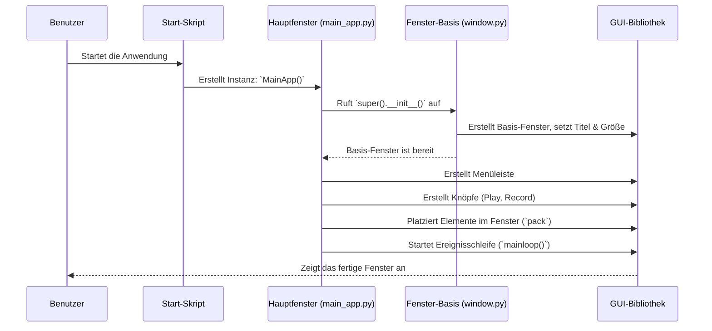

# Chapter 1: Hauptanwendungsfenster

Willkommen zum `MacroRecoder` Tutorial! In diesem ersten Kapitel lernst du das **Hauptanwendungsfenster** kennen. Dies ist der Dreh- und Angelpunkt der gesamten Anwendung.

Stell dir vor, du möchtest eine sich wiederholende Aufgabe am Computer automatisieren, zum Beispiel das tägliche Umbenennen von zehn Dateien nach einem bestimmten Muster. Genau hier kommt `MacroRecoder` ins Spiel. Um diese Aufgabe aufzuzeichnen und später automatisch ablaufen zu lassen, musst du die Anwendung starten und mit ihr interagieren. Das erste, was du siehst und womit du arbeitest, ist das Hauptanwendungsfenster.

## Was ist das Hauptanwendungsfenster?

Das Hauptanwendungsfenster ist das zentrale Fenster, das erscheint, wenn du `MacroRecoder` startest. Man kann es sich wie das Armaturenbrett in einem Auto vorstellen: Es zeigt dir die wichtigsten Informationen an und gibt dir direkten Zugriff auf die grundlegenden Bedienelemente.

Wenn du die Anwendung öffnest, siehst du ein kleines Fenster mit:

1.  **Aufnahme- und Wiedergabeschaltflächen:** Zwei große, gut sichtbare Knöpfe, meistens ein roter Kreis zum Aufnehmen und ein grünes Dreieck zum Abspielen.
2.  **Menüleiste:** Ganz oben im Fenster befindet sich eine Leiste mit Menüs wie "Datei", "Einstellungen" usw., über die du auf weitere Funktionen zugreifen kannst.

Von diesem Fenster aus steuerst du alles Weitere: Du startest die Aufnahme deiner Aktionen, spielst aufgezeichnete Makros ab, lädst oder speicherst Makro-Dateien und passt die Einstellungen an. Es ist der Ausgangspunkt für alles, was du mit `MacroRecoder` machen möchtest.

## Wie wird das Fenster gestartet?

Wenn du `MacroRecoder` ausführst, wird im Hintergrund ein kleines Python-Skript gestartet. Dieses Skript, `main.py`, hat nur eine Hauptaufgabe: Es importiert und startet das Hauptfenster.

```python
# Datei: src/main.py
from windows import MainApp # Importiert die Klasse für das Hauptfenster
from sys import platform

# (Optionaler Code für Windows DPI-Einstellungen)
if platform.lower() == "win32":
    import ctypes
    PROCESS_PER_MONITOR_DPI_AWARE = 2
    ctypes.windll.shcore.SetProcessDpiAwareness(PROCESS_PER_MONITOR_DPI_AWARE)

# Hauptteil: Startet die Anwendung
if __name__ == "__main__":
    MainApp() # Erstellt und zeigt das Hauptfenster an
```

Dieser Code prüft zuerst, ob das Betriebssystem Windows ist, um gegebenenfalls die DPI-Einstellungen anzupassen (damit das Fenster auf hochauflösenden Bildschirmen gut aussieht). Der entscheidende Teil ist `MainApp()`. Dieser Aufruf erstellt eine Instanz der Klasse `MainApp`, die in `src/windows/main/main_app.py` definiert ist, und startet damit die grafische Benutzeroberfläche.

## Aufbau des Hauptfensters (vereinfacht)

Die Klasse `MainApp` ist dafür verantwortlich, das Fenster zu erstellen und mit Leben zu füllen. Schauen wir uns einen stark vereinfachten Teil des Codes an, der das Fenster initialisiert:

```python
# Datei: src/windows/main/main_app.py
# (Importe wurden zur Übersichtlichkeit entfernt)
from tkinter import *
from windows.window import Window # Basisklasse für Fenster
from windows.main.menu_bar import MenuBar # Die Menüleiste
from macro import Macro # Die Logik für Aufnahme/Wiedergabe

class MainApp(Window):
    """Hauptfenster der Anwendung"""

    def __init__(self):
        # 1. Basis-Fenster erstellen (Titel, Größe)
        super().__init__("PyMacroRecord", 350, 200)

        # 2. Wichtige Komponenten initialisieren
        self.menu = MenuBar(self) # Erstellt die [Menüleiste](06_menüleiste.md)
        self.macro = Macro(self) # Bereitet die [Makro-Aufnahme & Wiedergabe](02_makro_aufnahme___wiedergabe.md) vor

        # 3. Haupt-Schaltflächen hinzufügen
        self.center_frame = Frame(self) # Ein Rahmen für die Knöpfe
        self.center_frame.pack(expand=True, fill=BOTH)

        # (Code zum Laden der Knopf-Bilder...)
        self.playImg = PhotoImage(...) # Lädt das Play-Symbol
        self.recordImg = PhotoImage(...) # Lädt das Record-Symbol

        # Erstellt den Play-Knopf
        self.playBtn = Button(self.center_frame, image=self.playImg,
                              command=self.macro.start_playback)
        self.playBtn.pack(side=LEFT, padx=50)

        # Erstellt den Record-Knopf
        self.recordBtn = Button(self.center_frame, image=self.recordImg,
                                command=self.macro.start_record)
        self.recordBtn.pack(side=RIGHT, padx=50)

        # 4. Fenster anzeigen und auf Interaktion warten
        self.mainloop()
```

Was hier passiert:

1.  `super().__init__(...)`: Ruft den Konstruktor der übergeordneten Klasse `Window` auf, um das eigentliche Fenster mit einem Titel ("PyMacroRecord") und einer festen Größe (350x200 Pixel) zu erstellen. Diese `Window`-Klasse (aus `src/windows/window.py`) sorgt auch dafür, dass das Fenster in der Mitte des Bildschirms erscheint.
2.  `self.menu = MenuBar(self)`: Erstellt die [Menüleiste](06_menüleiste.md) oben im Fenster.
3.  `self.macro = Macro(self)`: Initialisiert das Objekt, das sich um die eigentliche [Makro-Aufnahme & Wiedergabe](02_makro_aufnahme___wiedergabe.md) kümmert.
4.  `Frame`, `PhotoImage`, `Button`, `pack`: Diese Befehle (aus der `tkinter`-Bibliothek) erstellen einen unsichtbaren Rahmen (`center_frame`), laden die Bilder für die Knöpfe, erstellen die eigentlichen `Button`-Elemente mit den Bildern und weisen ihnen Funktionen zu (`command=...`), die beim Klicken ausgeführt werden sollen (z.B. `self.macro.start_record`). `pack` platziert die Elemente im Fenster (hier die Knöpfe links und rechts mit etwas Abstand).
5.  `self.mainloop()`: Startet die Ereignisschleife des Fensters. Das bedeutet, das Programm wartet nun auf Benutzeraktionen (Klicks, Tastatureingaben etc.) und reagiert darauf, bis das Fenster geschlossen wird.

## Was passiert im Hintergrund? (Ein einfacher Ablauf)

Wenn du `MacroRecoder` startest, laufen ungefähr diese Schritte ab, um das Hauptfenster anzuzeigen:



Dieser Ablauf zeigt, wie `main.py` die `MainApp`-Klasse nutzt, die wiederum auf der `Window`-Basisklasse und der `Tkinter`-Bibliothek aufbaut, um das sichtbare Fenster Schritt für Schritt zu konstruieren und anzuzeigen.

## Die Fenster-Basisklasse (`Window`)

Die `MainApp` erbt von einer einfacheren Klasse namens `Window`. Diese Basisklasse kümmert sich um grundlegende Dinge wie die Fenstergröße und Positionierung.

```python
# Datei: src/windows/window.py
from tkinter import *

class Window(Tk):
    def __init__(self, name, w, h):
        super().__init__() # Initialisiert das Tkinter-Fenster
        self.title(name)  # Setzt den Fenstertitel

        # Bildschirmabmessungen holen
        ws = self.winfo_screenwidth()
        hs = self.winfo_screenheight()

        # Position für die Fenstermitte berechnen
        x = (ws / 2) - (w / 2)
        y = (hs / 2) - (h / 2)

        # Fenstergröße und Position setzen
        self.geometry('%dx%d+%d+%d' % (w, h, x, y))
        self.resizable(False, False) # Fenstergröße nicht änderbar machen
```

Dieser Code sorgt dafür, dass jedes Fenster, das von `Window` erbt (wie unser `MainApp`), automatisch in der Mitte des Bildschirms platziert wird und eine feste Größe hat.

## Fazit

Das Hauptanwendungsfenster ist deine Kommandozentrale für `MacroRecoder`. Es bietet dir die grundlegenden Steuerelemente für Aufnahme und Wiedergabe und Zugang zu allen weiteren Funktionen über die Menüleiste. Du hast gesehen, wie es durch das Start-Skript (`main.py`) initialisiert wird und wie die `MainApp`-Klasse (in `main_app.py`) das Fenster mit Leben füllt, indem sie die notwendigen Knöpfe und Menüs hinzufügt und auf deine Eingaben wartet.

Im nächsten Kapitel werden wir uns genauer ansehen, was passiert, wenn du auf die Aufnahme- und Wiedergabeschaltflächen klickst.

Weiter geht's mit: [Kapitel 2: Makro-Aufnahme & Wiedergabe](02_makro_aufnahme___wiedergabe.md)

---

Generated by [AI Codebase Knowledge Builder](https://github.com/The-Pocket/Tutorial-Codebase-Knowledge)