# Chapter 2: Makro-Aufnahme & Wiedergabe

Herzlich willkommen zu Kapitel 2! Im [vorigen Kapitel](01_hauptanwendungsfenster.md) haben wir das [Hauptanwendungsfenster](01_hauptanwendungsfenster.md) kennengelernt, unsere Kommandozentrale für `MacroRecoder`. Jetzt tauchen wir tiefer ein und schauen uns das Herzstück der Anwendung an: Wie nehmen wir eigentlich Aktionen auf und spielen sie wieder ab?

Stell dir vor, du musst dich jeden Morgen auf einer bestimmten Webseite einloggen. Immer die gleiche Routine: Webseite öffnen, Benutzername eintippen, Tabulator drücken, Passwort eintippen, Enter drücken. Das ist mühsam und kostet Zeit. Genau hier kommt die Aufnahme- und Wiedergabefunktion von `MacroRecoder` ins Spiel. Du kannst diese Schritte einmal aufnehmen und `MacroRecoder` sie dann jeden Tag für dich erledigen lassen!

## Was sind Makro-Aufnahme & Wiedergabe?

Diese Funktion ist wie ein Kassettenrekorder für deinen Computer:

1.  **Aufnahme (Recording):** Wenn du die Aufnahme startest, "lauscht" `MacroRecoder` im Hintergrund. Es merkt sich jede Mausbewegung, jeden Klick und jeden Tastendruck, den du machst. Dabei wird auch genau festgehalten, *wann* jede Aktion passiert ist. All diese Aktionen werden nacheinander in einer Liste gespeichert, ähnlich wie Noten auf einem Notenblatt.
2.  **Wiedergabe (Playback):** Wenn du die Wiedergabe startest, liest `MacroRecoder` diese gespeicherte Liste von Aktionen durch. Es führt dann jede Aktion genau so aus, wie du sie aufgenommen hast – mit der gleichen Mausbewegung, den gleichen Klicks und Tastendrücken, und das alles im ursprünglichen zeitlichen Abstand (oder schneller/langsamer, je nach [Einstellungen](05_benutzereinstellungen.md)).

Das Ziel ist es, wiederkehrende Aufgaben zu automatisieren, damit du deine Zeit für wichtigere Dinge nutzen kannst.

## Wie funktioniert das? Ein einfacher Durchlauf

Lass uns unser Beispiel mit dem täglichen Login durchspielen:

1.  **Öffne `MacroRecoder`:** Du siehst das [Hauptanwendungsfenster](01_hauptanwendungsfenster.md) mit dem roten Aufnahme-Knopf und dem grünen Wiedergabe-Knopf.
2.  **Starte die Aufnahme:** Klicke auf den roten Aufnahme-Knopf (🔴). Ab jetzt zeichnet `MacroRecoder` alles auf.
3.  **Führe die Aktionen aus:** Öffne deinen Webbrowser, gehe zur Login-Seite, klicke ins Benutzername-Feld, tippe deinen Benutzernamen, drücke die Tab-Taste, tippe dein Passwort, drücke die Enter-Taste.
4.  **Stoppe die Aufnahme:** Klicke wieder auf den (jetzt vielleicht als Stopp-Symbol dargestellten) Knopf im `MacroRecoder`-Fenster. Die Aufnahme ist beendet. Deine Aktionen sind jetzt als "Makro" gespeichert (vorerst nur im Speicher). Du könntest dieses Makro nun über das Menü speichern ([Makro-Dateiverwaltung](04_makro_dateiverwaltung.md)).
5.  **Starte die Wiedergabe:** Klicke auf den grünen Wiedergabe-Knopf (▶️).
6.  **Lehn dich zurück:** `MacroRecoder` wird nun automatisch den Browser steuern, die Felder ausfüllen und Enter drücken – genau wie du es zuvor getan hast.

## Ein Blick unter die Haube: Die `Macro` Klasse

Im Hintergrund kümmert sich eine spezielle Komponente um all das: die `Macro`-Klasse (definiert in `src/macro/macro.py`). Sie wird direkt vom [Hauptanwendungsfenster](01_hauptanwendungsfenster.md) erstellt und genutzt.

```python
# Datei: src/windows/main/main_app.py (Ausschnitt aus Kapitel 1)

# ... (andere Importe)
from macro import Macro # Importiert die Makro-Logik

class MainApp(Window):
    def __init__(self):
        # ... (Fenster erstellen)

        # Erstellt das Objekt, das Aufnahme/Wiedergabe steuert
        self.macro = Macro(self)

        # ... (Knöpfe erstellen und mit Macro-Funktionen verbinden)
        self.playBtn = Button(..., command=self.macro.start_playback) # Startet Wiedergabe
        self.recordBtn = Button(..., command=self.macro.start_record) # Startet Aufnahme

        # ... (Restlicher Code)
```

Wenn du auf den Aufnahme- oder Wiedergabeknopf klickst, werden die entsprechenden Funktionen (`start_record`, `start_playback`) des `self.macro`-Objekts aufgerufen.

### Was passiert bei der Aufnahme? (`start_record`)

Wenn `start_record` aufgerufen wird, passiert Folgendes:

1.  **Vorbereitung:** Eine leere Liste (`self.macro_events`) wird erstellt, um die Aktionen aufzunehmen. Die aktuelle Zeit wird gespeichert, um die Zeitabstände zwischen den Aktionen messen zu können.
2.  **Zuhörer starten:** `MacroRecoder` nutzt eine externe Bibliothek namens `pynput`. Diese Bibliothek erlaubt es, "Zuhörer" (Listener) für Maus und Tastatur zu starten. Diese Listener laufen im Hintergrund und melden jede Aktion (Bewegung, Klick, Tastendruck) sofort an unser Programm.
3.  **Status ändern:** Der Aufnahmeknopf ändert sein Aussehen (z.B. zu einem Stopp-Symbol) und der Wiedergabeknopf wird deaktiviert.

```python
# Datei: src/macro/macro.py (Stark vereinfacht)
from pynput import mouse, keyboard # Bibliothek zum Lauschen/Steuern
from time import time

class Macro:
    def __init__(self, main_app):
        # ... (andere Initialisierungen)
        self.record = False # Ist Aufnahme aktiv?
        self.playback = False # Ist Wiedergabe aktiv?
        self.macro_events = {"events": []} # Liste für aufgenommene Aktionen
        self.main_app = main_app # Referenz zum Hauptfenster
        self.time = None # Zeitstempel für Timing
        self.event_delta_time = 0 # Zeit seit letztem Event

        # Grundlegende Listener (Tastatur ist immer aktiv, z.B. für Hotkeys)
        self.keyboard_listener = keyboard.Listener(
                on_press=self.__on_press, on_release=self.__on_release
            )
        self.keyboard_listener.start()

    def start_record(self, by_hotkey=False):
        # (Prüfungen entfernt)
        self.macro_events = {"events": []} # Leere Liste für neue Aufnahme
        self.record = True # Aufnahme-Flag setzen
        self.time = time() # Startzeit merken
        self.event_delta_time = 0

        # Starte Maus-Zuhörer (vereinfacht)
        # Abhängig von den Einstellungen ([Benutzereinstellungen](05_benutzereinstellungen.md))
        self.mouse_listener = mouse.Listener(
            on_move=self.__on_move, on_click=self.__on_click, on_scroll=self.__on_scroll
        )
        self.mouse_listener.start()

        # Tastatur-Aufnahme aktivieren (Flag setzen)
        self.keyboardBeingListened = True

        # Knöpfe im Hauptfenster aktualisieren
        self.main_app.recordBtn.configure(command=self.stop_record) # Nächster Klick stoppt
        self.main_app.playBtn.configure(state=DISABLED) # Wiedergabe während Aufnahme sperren
        print("Aufnahme gestartet")

    def stop_record(self):
        if not self.record: return # Nur stoppen, wenn Aufnahme läuft
        self.record = False # Aufnahme-Flag zurücksetzen

        # Zuhörer stoppen
        if self.mouse_listener: self.mouse_listener.stop()
        self.keyboardBeingListened = False # Tastatur nicht mehr speichern

        # Knöpfe im Hauptfenster zurücksetzen
        self.main_app.recordBtn.configure(command=self.start_record)
        self.main_app.playBtn.configure(state=NORMAL)
        print("Aufnahme gestoppt")

    # --- Interne Helferfunktionen ---

    def __get_event_delta_time(self):
        """Berechnet die Zeit seit dem letzten Ereignis."""
        timenow = time()
        self.event_delta_time = timenow - self.time # Differenz berechnen
        self.time = timenow # Neue Zeit speichern

    def __record_event(self, event_data):
        """Fügt ein Ereignis zur Liste hinzu, mit Zeitstempel."""
        event_data['timestamp'] = self.event_delta_time # Zeitdifferenz speichern
        self.macro_events["events"].append(event_data)
        # Optional: Zeige Event in Statusleiste an
        # self.main_app.status_text.configure(text=f"...")

    # Diese Funktionen werden von den pynput-Listenern aufgerufen:
    def __on_move(self, x, y):
        self.__get_event_delta_time() # Zeit messen
        self.__record_event({"type": "cursorMove", "x": x, "y": y})

    def __on_click(self, x, y, button, pressed):
        self.__get_event_delta_time()
        # (Code zur Bestimmung des Knopf-Namens vereinfacht)
        button_event = "leftClickEvent" if button == mouse.Button.left else "otherClick"
        self.__record_event({"type": button_event, "x": x, "y": y, "pressed": pressed})

    def __on_scroll(self, x, y, dx, dy):
        self.__get_event_delta_time()
        self.__record_event({"type": "scrollEvent", "dx": dx, "dy": dy})

    def __on_press(self, key):
        if self.keyboardBeingListened: # Nur speichern, wenn Aufnahme aktiv ist
            self.__get_event_delta_time()
            key_name = str(key) # Vereinfachte Tastenbezeichnung
            self.__record_event({"type": "keyboardEvent", "key": key_name, "pressed": True})

    def __on_release(self, key):
        if self.keyboardBeingListened:
            self.__get_event_delta_time()
            key_name = str(key)
            self.__record_event({"type": "keyboardEvent", "key": key_name, "pressed": False})

```

Jedes Mal, wenn du die Maus bewegst, klickst, scrollst oder eine Taste drückst/loslässt, wird eine der `__on_...`-Funktionen aufgerufen. Diese berechnet die Zeit seit der letzten Aktion (`__get_event_delta_time`) und fügt dann ein kleines Datenpaket (ein Dictionary) zur `self.macro_events["events"]`-Liste hinzu (`__record_event`). Dieses Paket enthält:

*   `type`: Was für eine Aktion war es? (`cursorMove`, `leftClickEvent`, `keyboardEvent`, etc.)
*   Details: Wo war der Klick? (`x`, `y`), Welche Taste wurde gedrückt? (`key`), Wurde sie gedrückt oder losgelassen? (`pressed`)
*   `timestamp`: Wie viel Zeit ist seit der *letzten* Aktion vergangen? (Sehr wichtig für die Wiedergabe!)

Wenn du die Aufnahme stoppst (`stop_record`), werden die Listener beendet und die Liste der Ereignisse ist fertig.

### Was passiert bei der Wiedergabe? (`start_playback`)

Wenn `start_playback` aufgerufen wird:

1.  **Vorbereitung:** Das `playback`-Flag wird auf `True` gesetzt.
2.  **Steuerung übernehmen:** `MacroRecoder` nutzt wieder `pynput`, aber diesmal nicht zum Lauschen, sondern zum *Steuern* von Maus und Tastatur. Es verwendet sogenannte "Controller".
3.  **Aktionen abspielen (in einem separaten Thread):** Die Wiedergabe selbst läuft in einem eigenen "Thread". Das ist wichtig, damit das Hauptfenster nicht einfriert, während das Makro läuft. Diese Funktion (`__play_events`) geht die gespeicherte Liste `self.macro_events["events"]` Schritt für Schritt durch.
4.  **Status ändern:** Der Wiedergabeknopf ändert sein Aussehen und der Aufnahmeknopf wird deaktiviert.

```python
# Datei: src/macro/macro.py (Stark vereinfacht)
from pynput import mouse, keyboard
from time import sleep
from threading import Thread # Für nebenläufige Wiedergabe

class Macro:
    # ... (init, start_record, stop_record, Listener-Funktionen wie oben)

    def __init__(self, main_app):
        # ...
        # Controller zum Steuern von Maus und Tastatur
        self.mouseControl = mouse.Controller()
        self.keyboardControl = keyboard.Controller()
        # ...

    def start_playback(self):
        self.playback = True # Wiedergabe-Flag setzen

        # Knöpfe aktualisieren
        self.main_app.playBtn.configure(command=self.stop_playback) # Nächster Klick stoppt
        self.main_app.recordBtn.configure(state=DISABLED)

        # Wiedergabe in einem separaten Thread starten, damit das Fenster nicht blockiert
        Thread(target=self.__play_events).start()
        print("Wiedergabe gestartet")

    def stop_playback(self, manually_stopped=False):
        self.playback = False # Wiedergabe-Flag zurücksetzen
        # Knöpfe zurücksetzen
        self.main_app.playBtn.configure(command=self.start_playback)
        self.main_app.recordBtn.configure(state=NORMAL)
        if manually_stopped:
            print("Wiedergabe manuell gestoppt")
        else:
            print("Wiedergabe beendet")


    def __play_events(self):
        """Spielt die aufgezeichneten Ereignisse ab."""
        # Hole Einstellungen (z.B. Geschwindigkeit)
        userSettings = self.main_app.settings.get_config()
        speed_factor = 1 / userSettings["Playback"]["Speed"] # Faktor für Zeitverzögerung

        # Gehe jedes gespeicherte Ereignis durch
        for event in self.macro_events["events"]:
            if not self.playback: break # Sofort abbrechen, wenn gestoppt wurde

            # 1. Warte die aufgezeichnete Zeit (ggf. angepasst durch Geschwindigkeit)
            time_to_sleep = event['timestamp'] * speed_factor
            if time_to_sleep < 0: time_to_sleep = 0 # Keine negative Wartezeit
            sleep(time_to_sleep)

            # 2. Führe die Aktion aus
            event_type = event['type']

            if event_type == "cursorMove":
                self.mouseControl.position = (event['x'], event['y'])
            elif event_type == "leftClickEvent": # (andere Klicks vereinfacht)
                self.mouseControl.position = (event['x'], event['y'])
                if event['pressed']:
                    self.mouseControl.press(mouse.Button.left)
                else:
                    self.mouseControl.release(mouse.Button.left)
            elif event_type == "scrollEvent":
                self.mouseControl.scroll(event['dx'], event['dy'])
            elif event_type == "keyboardEvent":
                try:
                    key_to_process = event['key']
                    # (Komplexe Tasten-Umwandlung hier vereinfacht)
                    if "Key." in key_to_process: key_to_process = eval(key_to_process) # Spezialtasten

                    if event['pressed']:
                        self.keyboardControl.press(key_to_process)
                    else:
                        self.keyboardControl.release(key_to_process)
                except Exception as e:
                    print(f"Fehler beim Abspielen der Taste {event['key']}: {e}")
                    # (Im echten Code gäbe es hier bessere Fehlerbehandlung)

        # Wenn die Schleife durchgelaufen ist (und nicht manuell gestoppt wurde)
        if self.playback:
            self.stop_playback() # Automatisch stoppen nach Ablauf

```

Die Funktion `__play_events` ist der Kern der Wiedergabe. Sie durchläuft die `events`-Liste. Für jedes Ereignis:

1.  **Wartet** sie die Zeit, die im `timestamp` gespeichert ist (multipliziert mit einem Faktor für die Wiedergabegeschwindigkeit aus den [Benutzereinstellungen](05_benutzereinstellungen.md)).
2.  **Führt** sie die entsprechende Aktion aus, indem sie die `pynput`-Controller (`self.mouseControl`, `self.keyboardControl`) anweist, die Maus zu bewegen, zu klicken oder eine Taste zu drücken/loszulassen.

### Ablaufdiagramm (Vereinfacht)

So interagieren die Teile bei Aufnahme und Wiedergabe:

```mermaid
sequenceDiagram
    participant User as Benutzer
    participant MainApp as Hauptfenster
    participant Macro as Makro-Logik
    participant pynput as Input-Bibliothek

    User->>MainApp: Klickt Aufnahme-Knopf
    MainApp->>Macro: Ruft `start_record()` auf
    Macro->>pynput: Startet Maus/Tastatur-Listener
    pynput-->>Macro: Meldet Ereignis (z.B. Klick bei x,y)
    Macro->>Macro: Berechnet Zeitdifferenz, speichert Ereignis in Liste
    User->>MainApp: Klickt Stopp-Knopf
    MainApp->>Macro: Ruft `stop_record()` auf
    Macro->>pynput: Stoppt Listener
    User->>MainApp: Klickt Wiedergabe-Knopf
    MainApp->>Macro: Ruft `start_playback()` auf
    Macro->>Macro: Startet `__play_events` (in neuem Thread)
    loop Für jedes Ereignis in Liste
        Macro->>Macro: Liest Ereignis & Zeitstempel
        Macro->>Macro: Wartet (sleep)
        Macro->>pynput: Führt Aktion aus (z.B. `mouseControl.click()`)
    end
    Macro->>MainApp: Ruft `stop_playback()` auf (nach Ende oder Abbruch)
```



## Zusätzliche Möglichkeiten

*   **Geschwindigkeit:** In den [Benutzereinstellungen](05_benutzereinstellungen.md) kannst du festlegen, ob das Makro schneller oder langsamer als in Echtzeit abgespielt werden soll.
*   **Wiederholung:** Du kannst einstellen, wie oft ein Makro wiederholt werden soll oder ob es in einer Endlosschleife laufen soll.
*   **Hotkeys:** Anstatt die Knöpfe zu klicken, kannst du auch Tastenkombinationen ([Hotkey-Verwaltung](03_hotkey_verwaltung.md)) definieren, um die Aufnahme und Wiedergabe zu starten und zu stoppen – sehr praktisch!
*   **Speichern & Laden:** Aufgenommene Makros gehen nicht verloren! Du kannst sie als Dateien speichern und später wieder laden ([Makro-Dateiverwaltung](04_makro_dateiverwaltung.md)).

## Fazit

Du hast nun gelernt, wie das Herzstück von `MacroRecoder` funktioniert:

*   Die **Aufnahme** lauscht auf deine Maus- und Tastaturaktionen und speichert sie zusammen mit Zeitinformationen in einer Liste.
*   Die **Wiedergabe** geht diese Liste durch und führt die Aktionen nacheinander wieder aus, wobei die Zeitabstände berücksichtigt werden (und durch Einstellungen angepasst werden können).
*   Die `Macro`-Klasse und die `pynput`-Bibliothek sind die Hauptakteure hinter den Kulissen.

Damit kannst du nun beginnen, deine eigenen wiederkehrenden Aufgaben zu automatisieren! Im nächsten Kapitel schauen wir uns an, wie du die Aufnahme und Wiedergabe noch bequemer über Tastenkombinationen steuern kannst.

Weiter geht's mit: [Kapitel 3: Hotkey-Verwaltung](03_hotkey_verwaltung.md)

---

Generated by [AI Codebase Knowledge Builder](https://github.com/The-Pocket/Tutorial-Codebase-Knowledge)