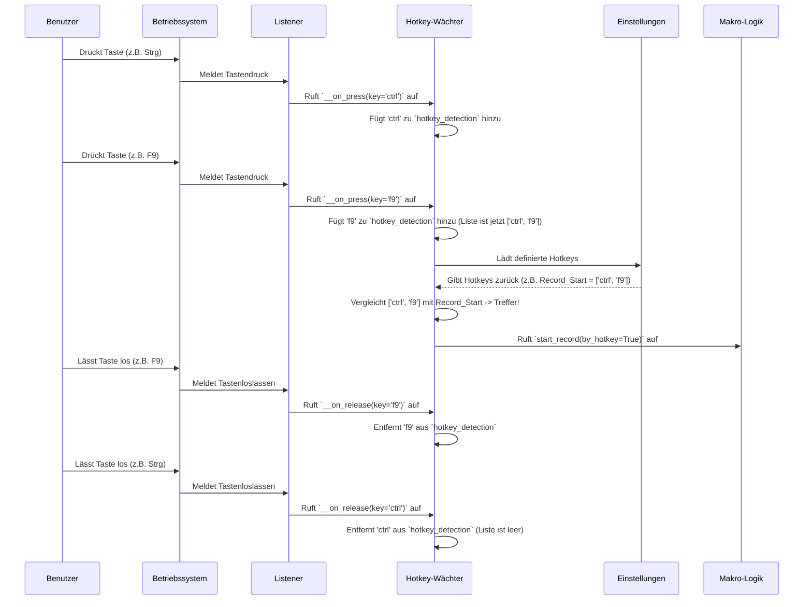

# Chapter 3: Hotkey-Verwaltung

Willkommen zu Kapitel 3! Im [vorigen Kapitel](02_makro_aufnahme___wiedergabe.md) haben wir gelernt, wie `MacroRecoder` deine Aktionen aufnimmt und wiedergibt. Das Klicken der Knöpfe im Hauptfenster ist einfach, aber was ist, wenn das Fenster gar nicht sichtbar ist oder du gerade in einer anderen Anwendung arbeitest? Hier kommt die **Hotkey-Verwaltung** ins Spiel!

Stell dir vor, du möchtest schnell die Aufnahme starten, während du mitten in einer komplexen Aufgabe in einem anderen Programm bist. Du willst nicht extra zum `MacroRecoder`-Fenster wechseln, den Aufnahme-Knopf suchen und klicken. Wäre es nicht viel praktischer, einfach eine Tastenkombination wie `Strg+Alt+R` zu drücken, egal wo du gerade bist, und die Aufnahme beginnt sofort? Genau das ermöglicht die Hotkey-Verwaltung.

## Was ist die Hotkey-Verwaltung?

Die Hotkey-Verwaltung ist wie ein wachsamer Wächter, der ständig im Hintergrund auf deine Tastatur lauscht. Sie achtet auf ganz bestimmte Tastenkombinationen – die sogenannten "Hotkeys" – die du selbst festlegen kannst. Diese Hotkeys sind wie geheime Passwörter oder Abkürzungen.

Wenn du eine dieser vordefinierten Tastenkombinationen drückst, erkennt der Wächter (die Hotkey-Verwaltung) sie und führt sofort die damit verbundene Aktion aus. Das kann sein:

*   Aufnahme starten
*   Aufnahme stoppen
*   Wiedergabe starten
*   Wiedergabe stoppen

Das Besondere daran ist: Es funktioniert **systemweit**. Das bedeutet, `MacroRecoder` muss nicht das aktive Fenster sein. Du kannst in deinem Browser, einem Spiel oder einem Texteditor arbeiten – sobald du den Hotkey drückst, reagiert `MacroRecoder`.

## Wie funktioniert das? (Die Idee)

1.  **Definieren:** Zuerst legst du in den [Benutzereinstellungen](05_benutzereinstellungen.md) fest, welche Tastenkombinationen welche Aktion auslösen sollen. Zum Beispiel: `Strg+Shift+F9` soll die Aufnahme starten.
2.  **Lauschen:** Sobald `MacroRecoder` läuft, startet im Hintergrund der `HotkeysManager`. Er nutzt die gleiche `pynput`-Bibliothek wie bei der Aufnahme, aber diesmal lauscht er *immer* auf die Tastatur, egal ob gerade aufgenommen oder abgespielt wird.
3.  **Erkennen:** Wenn du Tasten drückst, merkt sich der `HotkeysManager` die Kombination. Zum Beispiel drückst du `Strg`, dann `Shift` (hältst beide gedrückt) und dann `F9`.
4.  **Vergleichen:** Der Manager vergleicht die gedrückte Kombination (`Strg+Shift+F9`) mit den Hotkeys, die du in den Einstellungen gespeichert hast.
5.  **Auslösen:** Findet er eine Übereinstimmung (Ah! `Strg+Shift+F9` ist für "Aufnahme starten" zuständig!), ruft er die entsprechende Funktion in der [Makro-Aufnahme & Wiedergabe](02_makro_aufnahme___wiedergabe.md)-Logik auf (z.B. `self.macro.start_record()`).

## Ein Blick unter die Haube: Der `HotkeysManager`

Die zentrale Komponente für diese Aufgabe ist die Klasse `HotkeysManager`, definiert in `src/hotkeys/hotkeys_manager.py`. Sie wird vom [Hauptanwendungsfenster](01_hauptanwendungsfenster.md) initialisiert und erhält Zugriff auf die `Macro`-Instanz und die [Benutzereinstellungen](05_benutzereinstellungen.md).

```python
# Datei: src/hotkeys/hotkeys_manager.py (Stark vereinfacht)
from pynput import keyboard # Bibliothek zum Lauschen
# (Andere Importe weggelassen)

class HotkeysManager:
    def __init__(self, main_app):
        self.main_app = main_app # Referenz zum Hauptfenster
        self.settings = main_app.settings # Zugriff auf Einstellungen
        self.macro = main_app.macro # Zugriff auf Aufnahme/Wiedergabe-Logik
        self.hotkey_detection = [] # Liste der aktuell gedrückten Tasten
        self.changeKey = False # Modus: Hotkey ändern oder auslösen?

        # Starte den Tastatur-Listener sofort
        self.keyboard_listener = keyboard.Listener(
            on_press=self.__on_press,   # Was tun, wenn Taste gedrückt wird?
            on_release=self.__on_release # Was tun, wenn Taste losgelassen wird?
            # win32_event_filter=... # (Filter für Windows, ignoriert simulierte Tasten)
        )
        self.keyboard_listener.start() # Listener aktivieren
```

Das Wichtigste hier ist der `keyboard.Listener`. Ähnlich wie bei der Makro-Aufnahme lauscht er auf Tastendrücke (`__on_press`) und das Loslassen von Tasten (`__on_release`). Dieser Listener läuft aber die ganze Zeit, nicht nur während der Aufnahme.

### Was passiert beim Tastendruck? (`__on_press`)

Diese Funktion wird *jedes Mal* aufgerufen, wenn du irgendeine Taste drückst, egal in welcher Anwendung.

```python
# Datei: src/hotkeys/hotkeys_manager.py (Stark vereinfacht)

    def __on_press(self, key):
        # Nur ausführen, wenn wir nicht gerade einen Hotkey neu definieren
        if self.changeKey == False:
            # Hole die aktuell definierten Hotkeys aus den Einstellungen
            userSettings = self.settings.get_config()
            # Wandle die gedrückte Taste in einen lesbaren Namen um
            keyPressed = getKeyPressed(self.keyboard_listener, key) # Helferfunktion

            # Füge die gedrückte Taste zur Liste der aktuell gehaltenen Tasten hinzu
            if keyPressed not in self.hotkey_detection:
                self.hotkey_detection.append(keyPressed)

            # Prüfe, ob die aktuelle Kombination einem Hotkey entspricht
            # (Vereinfachte Darstellung der Logik)
            current_combination = self.hotkey_detection # z.B. ['Key.ctrl_l', 'Key.alt_l', 'r']

            # Ist es der Hotkey zum Starten der Aufnahme?
            if current_combination == userSettings["Hotkeys"]["Record_Start"]:
                # Und läuft gerade nichts anderes?
                if not self.macro.record and not self.macro.playback:
                    print("Hotkey für Aufnahme Start erkannt!")
                    self.macro.start_record(by_hotkey=True) # Starte Aufnahme

            # Ist es der Hotkey zum Stoppen der Aufnahme?
            elif current_combination == userSettings["Hotkeys"]["Record_Stop"]:
                if self.macro.record:
                    print("Hotkey für Aufnahme Stopp erkannt!")
                    self.macro.stop_record()

            # (Ähnliche Prüfungen für Playback Start/Stop...)

        # (Code zum Ändern von Hotkeys wird hier übersprungen)
```

Die Logik ist:
1.  Ignoriere den Tastendruck, wenn wir gerade im "Änderungsmodus" für Hotkeys sind (`self.changeKey == True`).
2.  Finde heraus, welche Taste gedrückt wurde (`keyPressed`).
3.  Füge diese Taste zur Liste `self.hotkey_detection` hinzu. Diese Liste enthält alle Tasten, die *aktuell* gleichzeitig gedrückt gehalten werden.
4.  Vergleiche diese Liste mit den in den [Benutzereinstellungen](05_benutzereinstellungen.md) gespeicherten Hotkey-Kombinationen (z.B. `userSettings["Hotkeys"]["Record_Start"]`).
5.  Wenn eine Übereinstimmung gefunden wird *und* die Aktion sinnvoll ist (z.B. Aufnahme starten geht nur, wenn nicht schon aufgenommen oder abgespielt wird), rufe die entsprechende Funktion im `self.macro`-Objekt auf.

### Was passiert beim Loslassen der Taste? (`__on_release`)

Wenn eine Taste losgelassen wird, muss sie aus der Liste der aktuell gedrückten Tasten (`self.hotkey_detection`) entfernt werden.

```python
# Datei: src/hotkeys/hotkeys_manager.py (Stark vereinfacht)

    def __on_release(self, key):
        # (Code zum Ändern von Hotkeys wird hier übersprungen)

        # Entferne die losgelassene Taste aus der Liste (vereinfacht)
        if len(self.hotkey_detection) != 0:
            # Im echten Code wird die spezifische Taste entfernt.
            # Hier vereinfacht: Wir entfernen einfach die zuletzt hinzugefügte.
            self.hotkey_detection.pop()
```

Das sorgt dafür, dass `self.hotkey_detection` immer nur die Tasten enthält, die gerade *jetzt* gedrückt sind. Wenn du also `Strg+Alt+R` drückst und dann `R` loslässt, enthält die Liste nur noch `Strg+Alt`. Lässt du dann `Alt` los, ist nur noch `Strg` drin. Lässt du `Strg` los, ist die Liste leer.

### Ablaufdiagramm: Hotkey auslösen



## Hotkeys festlegen und ändern

Wie legst du nun deine eigenen Hotkeys fest? Das geschieht über ein spezielles Einstellungsfenster ([GUI-Popup-Fenster](07_gui_popup_fenster.md)), das du über die [Benutzereinstellungen](05_benutzereinstellungen.md) erreichst. Dieses Fenster (`src/windows/options/settings/hotkeys.py`) zeigt dir die aktuellen Hotkeys an und erlaubt dir, sie zu ändern oder zu löschen.

Wenn du auf einen Knopf zum Ändern eines Hotkeys klickst (z.B. "Aufnahme starten Hotkey ändern"), passiert Folgendes im `HotkeysManager`:

1.  Die Funktion `enableHotKeyDetection` wird aufgerufen.
2.  Sie merkt sich, welcher Hotkey geändert werden soll (`type_of_hotkey`) und welches Anzeigefeld (`entry_to_change`) im Einstellungsfenster aktualisiert werden muss.
3.  Sie setzt `self.changeKey = True`. Das schaltet den `HotkeysManager` in den "Änderungsmodus".

```python
# Datei: src/hotkeys/hotkeys_manager.py (Ausschnitt)

    def enableHotKeyDetection(self, type_of_hotkey, entry_to_change, index):
        self.hotkey_button = entry_to_change # Das Label im Einstellungsfenster
        self.type_of_hotkey = type_of_hotkey # z.B. "Record_Start"
        self.index_to_change = index # (Nicht so wichtig für das Verständnis)
        self.changeKey = True # Aktiviert den Änderungsmodus!
        self.entry_to_change = entry_to_change
        # Zeigt "Bitte Taste(n) drücken..." im Einstellungsfenster an
        self.entry_to_change.configure(text="...")
        self.hotkeys = [] # Bereit für die neue Tastenkombination
        self.hotkey_visible = [] # Bereit für die Anzeige
```

Wenn `self.changeKey` auf `True` steht, verhält sich die `__on_press`-Funktion anders:

```python
# Datei: src/hotkeys/hotkeys_manager.py (Ausschnitt aus __on_press)

    def __on_press(self, key):
        userSettings = self.settings.get_config()
        if self.changeKey == True: # WENN wir im Änderungsmodus sind:
            keyPressed = getKeyPressed(self.keyboard_listener, key) # Taste holen
            # (Code zum Verhindern doppelter Tasten und zur Anzeige)
            if keyPressed not in self.hotkeys:
                self.hotkeys.append(keyPressed) # Speichere die Taste intern
                # (Code zum Erstellen der sichtbaren Anzeige, z.B. "CTRL+F9")
                visible_key = keyPressed.upper().replace(...)
                self.hotkey_visible.append(visible_key)

            # Aktualisiere die Anzeige im Einstellungsfenster sofort
            self.hotkey_button.configure(text=self.hotkey_visible)

            # Wenn eine "normale" Taste (kein Strg, Alt, Shift) gedrückt wurde,
            # ist die Kombination komplett.
            if not any(mod in keyPressed for mod in ["ctrl", "alt", "shift", 'cmd']):
                # (Code zur Fehlerprüfung: Ist der Hotkey schon vergeben?)
                # ...
                # Speichere den neuen Hotkey in den Einstellungen
                self.settings.change_settings(
                    "Hotkeys", self.type_of_hotkey, None, self.hotkeys
                )
                self.changeKey = False # Beende den Änderungsmodus
                # Setze temporäre Listen zurück
                self.hotkeys = []
                self.hotkey_visible = []
        else: # WENN NICHT im Änderungsmodus:
            # (Normale Hotkey-Erkennung wie oben beschrieben)
            # ...
```

Im Änderungsmodus werden gedrückte Tasten also nicht als Befehl interpretiert, sondern gesammelt (`self.hotkeys`). Sobald eine "normale" Taste (wie 'R', 'F9', '5' etc., also keine reine Modifikationstaste wie Strg, Alt, Shift) gedrückt wird, gilt die Kombination als vollständig. Sie wird dann in den [Benutzereinstellungen](05_benutzereinstellungen.md) gespeichert, und der `HotkeysManager` kehrt in den normalen Lausche-Modus (`self.changeKey = False`) zurück.

## Fazit

Die Hotkey-Verwaltung ist ein mächtiges Werkzeug, das dir erlaubt, `MacroRecoder` schnell und bequem zu steuern, ohne das Anwendungsfenster in den Vordergrund holen zu müssen. Der `HotkeysManager` lauscht ständig im Hintergrund auf deine Tastatureingaben, vergleicht sie mit den von dir definierten Hotkeys und löst bei einer Übereinstimmung die entsprechende Aktion (Aufnahme/Wiedergabe Start/Stopp) aus. Du hast auch gesehen, wie du über ein Einstellungsfenster diese Hotkeys selbst festlegen kannst.

Im nächsten Kapitel beschäftigen wir uns damit, wie du deine aufgezeichneten Makros dauerhaft speichern und wieder laden kannst.

Weiter geht's mit: [Kapitel 4: Makro-Dateiverwaltung](04_makro_dateiverwaltung.md)

---

Generated by [AI Codebase Knowledge Builder](https://github.com/The-Pocket/Tutorial-Codebase-Knowledge)