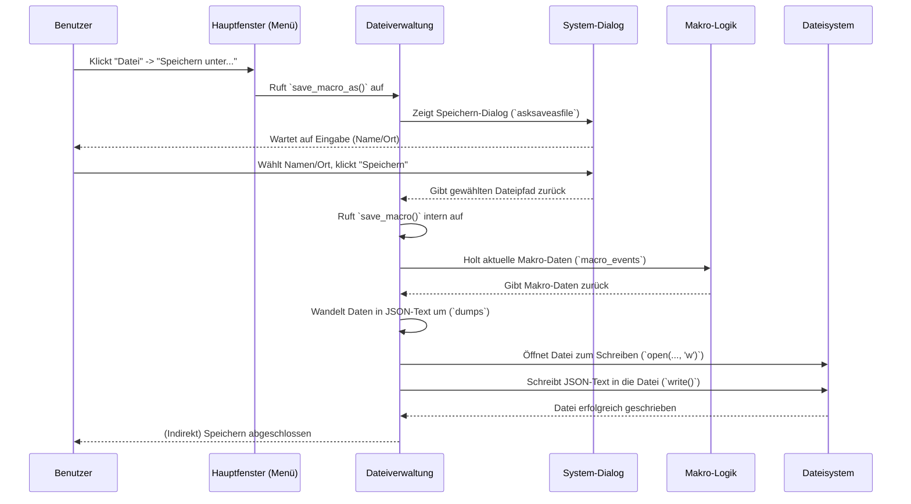
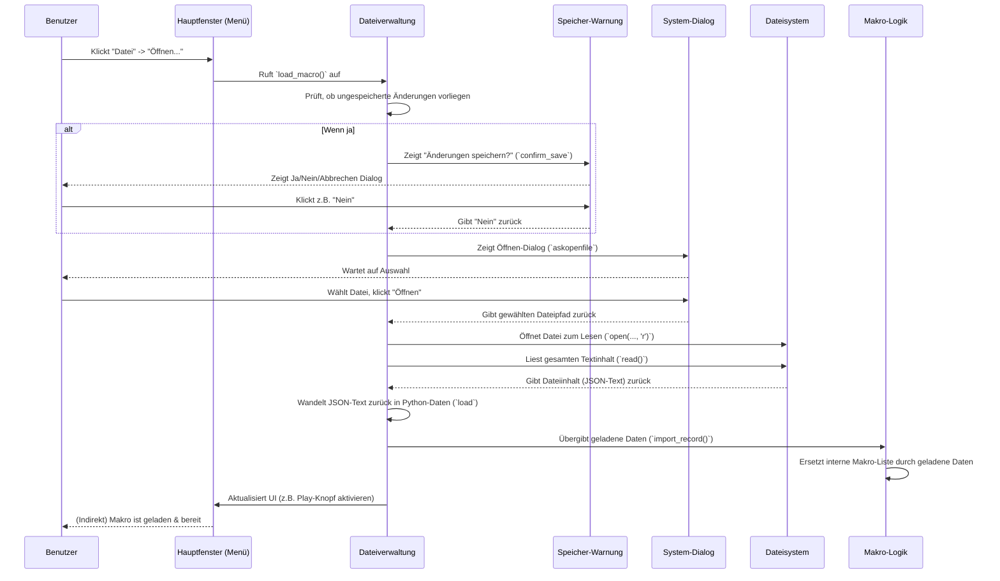

# Chapter 4: Makro-Dateiverwaltung

Hallo zurück! Im [vorherigen Kapitel](03_hotkey_verwaltung.md) haben wir gesehen, wie du mit [Hotkeys](03_hotkey_verwaltung.md) blitzschnell die Aufnahme und Wiedergabe steuern kannst, ohne das Hauptfenster von `MacroRecoder` anklicken zu müssen. Das ist super praktisch! Aber was passiert mit deinen mühevoll aufgenommenen Makros, wenn du `MacroRecoder` schließt? Sie wären weg! Genau hier kommt die **Makro-Dateiverwaltung** ins Spiel.

Stell dir vor, du hast gerade eine Stunde damit verbracht, einen komplexen Ablauf für das Erstellen deines wöchentlichen Berichts aufzunehmen. Das Makro funktioniert perfekt und spart dir viel Zeit. Du möchtest es nächste Woche natürlich wieder benutzen, ohne alles neu aufnehmen zu müssen. Vielleicht möchtest du es sogar einem Kollegen geben, der die gleiche Aufgabe hat. Wie kannst du dieses wertvolle Makro "festhalten"? Indem du es in einer Datei speicherst!

## Was ist die Makro-Dateiverwaltung?

Die Makro-Dateiverwaltung ist wie das Speichern und Öffnen von Dokumenten in einem Textverarbeitungsprogramm oder das Speichern eines Bildes in einem Zeichenprogramm. Sie ist dafür verantwortlich, dass deine aufgezeichneten Makro-Abläufe (die Sequenz von Klicks, Tastendrücken und Mausbewegungen) nicht verloren gehen.

Sie erlaubt dir:

1.  **Speichern:** Deine aktuelle Aufnahme als Datei auf deinem Computer zu sichern. Du kannst einen Namen und einen Speicherort wählen.
2.  **Laden:** Eine zuvor gespeicherte Makro-Datei wieder in `MacroRecoder` zu laden, um sie erneut abzuspielen.
3.  **Neu:** Eine leere Leinwand zu schaffen, um ein komplett neues Makro aufzunehmen, ohne das alte erst manuell löschen zu müssen.

Im Grunde verwandelt sie deine flüchtige Aufnahme im Arbeitsspeicher in eine dauerhafte Datei (oft im `.pmr`- oder `.json`-Format), die du behalten, kopieren, per E-Mail versenden oder auf einem USB-Stick speichern kannst – genau wie jede andere Datei.

## Wie benutze ich die Dateiverwaltung?

Die Funktionen zum Speichern und Laden findest du im [Hauptanwendungsfenster](01_hauptanwendungsfenster.md) in der [Menüleiste](06_menüleiste.md) unter dem Menüpunkt "Datei".

1.  **Makro Speichern:**
    *   Hast du ein Makro aufgenommen ([Kapitel 2](02_makro_aufnahme___wiedergabe.md)), das du behalten möchtest?
    *   Klicke auf "Datei" -> "Speichern unter...".
    *   Es öffnet sich ein **Standard-Speicherdialog**, wie du ihn von anderen Programmen kennst.
    *   Wähle einen Ordner, gib einen Dateinamen ein (z.B. `Wochenbericht_Makro.pmr`) und klicke auf "Speichern".
    *   Dein Makro ist jetzt sicher in dieser Datei gespeichert.
    *   Wenn du das Makro später änderst und erneut speichern möchtest, reicht ein Klick auf "Datei" -> "Speichern". Es wird dann unter dem gleichen Namen überschrieben.

2.  **Makro Laden:**
    *   Möchtest du ein früher gespeichertes Makro verwenden?
    *   Klicke auf "Datei" -> "Öffnen...".
    *   Es öffnet sich ein **Standard-Öffnendialog**.
    *   Navigiere zu dem Ordner, in dem du deine Makro-Datei gespeichert hast, wähle sie aus (z.B. `Wochenbericht_Makro.pmr`) und klicke auf "Öffnen".
    *   Das Makro wird in `MacroRecoder` geladen. Der "Wiedergabe"-Knopf wird aktiv, und du kannst das geladene Makro abspielen.

3.  **Neues Makro beginnen:**
    *   Möchtest du das aktuelle Makro verwerfen und ein neues aufnehmen?
    *   Klicke auf "Datei" -> "Neu".
    *   **Wichtig:** Wenn du das aktuelle Makro seit der letzten Speicherung geändert hast, fragt `MacroRecoder` dich, ob du die Änderungen speichern möchtest, bevor du ein neues Makro beginnst. Das verhindert, dass du versehentlich deine Arbeit verlierst.
    *   Danach ist `MacroRecoder` bereit für eine neue Aufnahme.

## Ein Blick unter die Haube: Die `RecordFileManagement` Klasse

Wer kümmert sich eigentlich um diese Dialoge und das Lesen und Schreiben der Dateien? Das macht die Klasse `RecordFileManagement`, die in der Datei `src/utils/record_file_management.py` definiert ist. Sie wird vom [Hauptanwendungsfenster](01_hauptanwendungsfenster.md) genutzt und arbeitet eng mit der [Makro-Logik](02_makro_aufnahme___wiedergabe.md) zusammen.

```python
# Datei: src/utils/record_file_management.py (vereinfacht)

from tkinter import filedialog # Für Standard-Datei-Dialoge
from json import load, dumps # Zum Umwandeln der Makro-Daten

# (Andere Importe weggelassen)
from utils.warning_pop_up_save import confirm_save # Popup für "Speichern?"

class RecordFileManagement:
    def __init__(self, main_app, menu_bar):
        self.main_app = main_app # Zugriff auf Hauptfenster & Makro-Objekt
        self.menu_bar = menu_bar # Zugriff auf Menüeinträge

    # Wird aufgerufen bei "Datei" -> "Speichern unter..."
    def save_macro_as(self, event=None):
        # (Prüfungen, ob überhaupt etwas zum Speichern da ist)
        # Zeige den Standard-Speicherdialog
        macroSaved = filedialog.asksaveasfile(
            filetypes=[("PyMacroRecord Files", "*.pmr"), ("Json Files", "*.json")],
            defaultextension=".pmr",
        )
        # Wenn der Benutzer einen Ort ausgewählt und "Speichern" geklickt hat:
        if macroSaved is not None:
            self.main_app.current_file = macroSaved.name # Pfad merken
            self.save_macro() # Die eigentliche Speicherfunktion aufrufen
            self.main_app.macro_saved = True # Merken, dass es gespeichert ist

    # Wird aufgerufen bei "Datei" -> "Speichern" oder von save_macro_as
    def save_macro(self, event=None):
        # (Prüfungen)
        # Wenn wir schon einen Dateipfad haben (durch "Speichern unter..." oder Laden):
        if self.main_app.current_file is not None:
            # Öffne die Datei zum Schreiben ('w' = write)
            with open(self.main_app.current_file, "w") as current_file:
                # Hole die Makro-Ereignisse aus der Makro-Logik
                macro_data = self.main_app.macro.macro_events
                # Wandle die Python-Liste/Dictionary in Text (JSON) um
                # (Option für kompaktes Speichern aus Einstellungen)
                json_macroEvents = dumps(macro_data, indent=4) # indent=4 für Lesbarkeit
                # Schreibe den JSON-Text in die Datei
                current_file.write(json_macroEvents)
        else:
            # Wenn noch kein Pfad bekannt ist, rufe "Speichern unter..." auf
            self.save_macro_as()

    # Wird aufgerufen bei "Datei" -> "Öffnen..."
    def load_macro(self, event=None):
        # (Prüfungen)
        # FRAGE: Wurde das aktuelle Makro geändert und nicht gespeichert?
        if not self.main_app.macro_saved and self.main_app.macro_recorded:
            wantToSave = confirm_save(self.main_app) # Zeige Popup "Speichern?"
            if wantToSave: self.save_macro() # Ja -> Speichern
            elif wantToSave is None: return # Abbrechen -> Nichts tun

        # Zeige den Standard-Öffnendialog
        macroFile = filedialog.askopenfile(
            filetypes=[("PyMacroRecord Files", "*.pmr"), ("Json Files", "*.json")]
        )
        # Wenn der Benutzer eine Datei ausgewählt hat:
        if macroFile is not None:
            macroFile.close() # Dialog schließt die Datei nicht automatisch
            # Öffne die Datei zum Lesen ('r' = read)
            with open(macroFile.name, "r") as macroContent:
                # Lese den JSON-Text aus der Datei und wandle ihn zurück
                # in ein Python-Objekt (Dictionary/Liste)
                loaded_data = load(macroContent)
            # Übergib die geladenen Daten an die Makro-Logik
            self.main_app.macro.import_record(loaded_data)
            # Aktualisiere den Zustand der App (Makro ist geladen und gespeichert)
            self.main_app.macro_recorded = True
            self.main_app.macro_saved = True
            self.main_app.current_file = macroFile.name # Pfad merken
            # (Code zum Aktivieren von Knöpfen/Menüs weggelassen)

    # Wird aufgerufen bei "Datei" -> "Neu"
    def new_macro(self, event=None):
        # (Prüfungen)
        # FRAGE: Wurde das aktuelle Makro geändert und nicht gespeichert?
        if not self.main_app.macro_saved and self.main_app.macro_recorded:
            wantToSave = confirm_save(self.main_app) # Zeige Popup
            if wantToSave: self.save_macro()
            elif wantToSave is None: return

        # Setze alles zurück für ein neues Makro
        self.main_app.current_file = None # Keinen Dateipfad mehr
        self.main_app.macro_saved = False # Nicht gespeichert
        self.main_app.macro_recorded = False # Kein Makro aufgenommen/geladen
        # (Code zum Deaktivieren von Knöpfen/Menüs weggelassen)
        # (Code zum Leeren der Makro-Daten in self.main_app.macro weggelassen)

```

### Was passiert beim Speichern? (Ein einfacher Ablauf)

Wenn du auf "Datei" -> "Speichern unter..." klickst:



Der Kern des Speicherns ist also:
1.  Den Benutzer nach einem Dateinamen und Ort fragen (via `filedialog.asksaveasfile`).
2.  Die Liste der Makro-Ereignisse (die wir in [Kapitel 2](02_makro_aufnahme___wiedergabe.md) kennengelernt haben) aus dem `Macro`-Objekt holen.
3.  Diese Liste in das **JSON-Format** umwandeln. JSON ist ein einfaches Textformat, das gut geeignet ist, um strukturierte Daten wie unsere Ereignisliste zu speichern. `dumps` (dump string) macht genau das.
4.  Den erzeugten JSON-Text in die vom Benutzer gewählte Datei schreiben.

Hier ist der wichtigste Teil des Codes für das eigentliche Schreiben:

```python
# Auszug aus RecordFileManagement.save_macro()

# Öffne die Datei zum Schreiben
with open(self.main_app.current_file, "w") as current_file:
    # Hole die Makro-Ereignisse
    macro_data = self.main_app.macro.macro_events
    # Wandle sie in gut lesbaren JSON-Text um
    json_macroEvents = dumps(macro_data, indent=4)
    # Schreibe den Text in die Datei
    current_file.write(json_macroEvents)
```

Die `indent=4` Option sorgt dafür, dass die JSON-Datei eingerückt und damit für Menschen leichter lesbar ist. In den [Benutzereinstellungen](05_benutzereinstellungen.md) kannst du dies auch deaktivieren ("Compact JSON"), um etwas Speicherplatz zu sparen.

### Was passiert beim Laden? (Ein einfacher Ablauf)

Wenn du auf "Datei" -> "Öffnen..." klickst:



Der Kern des Ladens:
1.  Den Benutzer fragen, ob er ungespeicherte Änderungen verwerfen will.
2.  Den Benutzer eine Datei auswählen lassen (via `filedialog.askopenfile`).
3.  Den Inhalt der Datei lesen (das ist der JSON-Text, den wir vorher gespeichert haben).
4.  Diesen JSON-Text zurück in eine Python-Datenstruktur (Liste/Dictionary) umwandeln. `load` (load from file/string) macht das.
5.  Diese Datenstruktur an das `Macro`-Objekt übergeben, damit es weiß, welche Schritte jetzt abgespielt werden sollen.

Hier ist der entscheidende Code-Teil für das Lesen und Verarbeiten:

```python
# Auszug aus RecordFileManagement.load_macro()

# Öffne die vom Benutzer gewählte Datei zum Lesen
with open(macroFile.name, "r") as macroContent:
    # Lese den JSON-Text und wandle ihn in Python-Daten um
    loaded_data = load(macroContent)

# Übergib die Daten an die Makro-Logik, um sie zu laden
self.main_app.macro.import_record(loaded_data)
```

### Die Sicherheitsabfrage: "Änderungen speichern?"

Damit du nicht versehentlich deine Arbeit verlierst, wenn du "Neu" oder "Öffnen" wählst, gibt es eine kleine Helferfunktion `confirm_save` in `src/utils/warning_pop_up_save.py`. Sie zeigt einfach ein Standard-Dialogfenster an.

```python
# Datei: src/utils/warning_pop_up_save.py

from tkinter import messagebox # Für Standard-Dialogfenster

def confirm_save(main_app):
    """Zeigt ein Fenster: 'Möchten Sie Ihre Aufnahme speichern?'"""
    return messagebox.askyesnocancel( # Zeigt einen Dialog mit Ja/Nein/Abbrechen
        main_app.text_content["global"]["confirm"], # Fenstertitel
        main_app.text_content["global"]["confirm_save"] # Frage im Fenster
    )
```

Diese Funktion gibt `True` zurück, wenn der Benutzer "Ja" klickt, `False` bei "Nein" und `None` bei "Abbrechen". Die `load_macro`- und `new_macro`-Funktionen verwenden diesen Rückgabewert, um zu entscheiden, was als Nächstes passieren soll.

## Das Dateiformat: `.pmr` und `.json`

Die Makros werden standardmäßig als `.pmr` (PyMacroRecord) Dateien gespeichert. Intern ist dies aber einfach eine **JSON-Datei**. JSON (JavaScript Object Notation) ist ein weit verbreitetes Textformat zum Austausch von Daten. Du könntest eine `.pmr`-Datei sogar mit einem einfachen Texteditor öffnen und dir (wenn "Compact JSON" aus ist) ansehen, wie die einzelnen Maus- und Tastaturereignisse mit ihren Details und Zeitstempeln gespeichert sind. Das macht es theoretisch sogar möglich, Makros manuell zu bearbeiten, auch wenn das nicht der primäre Zweck ist.

## Fazit

Die Makro-Dateiverwaltung ist dein Werkzeug, um Aufnahmen dauerhaft zu machen. Du hast gelernt:

*   Wie du über das "Datei"-Menü Makros **speichern** (`Speichern unter...`, `Speichern`) und **laden** (`Öffnen...`) kannst.
*   Wie du mit "Neu" ein frisches Makro startest und dabei vor versehentlichem Datenverlust geschützt wirst.
*   Dass im Hintergrund die `RecordFileManagement`-Klasse die Standard-Dateidialoge deines Betriebssystems nutzt.
*   Dass die Makro-Schritte als **JSON-Text** in `.pmr`- oder `.json`-Dateien geschrieben und von dort wieder gelesen werden.

Jetzt kannst du deine Automatisierungen sichern, wiederverwenden und sogar mit anderen teilen! Im nächsten Kapitel werfen wir einen Blick auf die verschiedenen Einstellungen, mit denen du `MacroRecoder` an deine Bedürfnisse anpassen kannst.

Weiter geht's mit: [Kapitel 5: Benutzereinstellungen](05_benutzereinstellungen.md)

---

Generated by [AI Codebase Knowledge Builder](https://github.com/The-Pocket/Tutorial-Codebase-Knowledge)