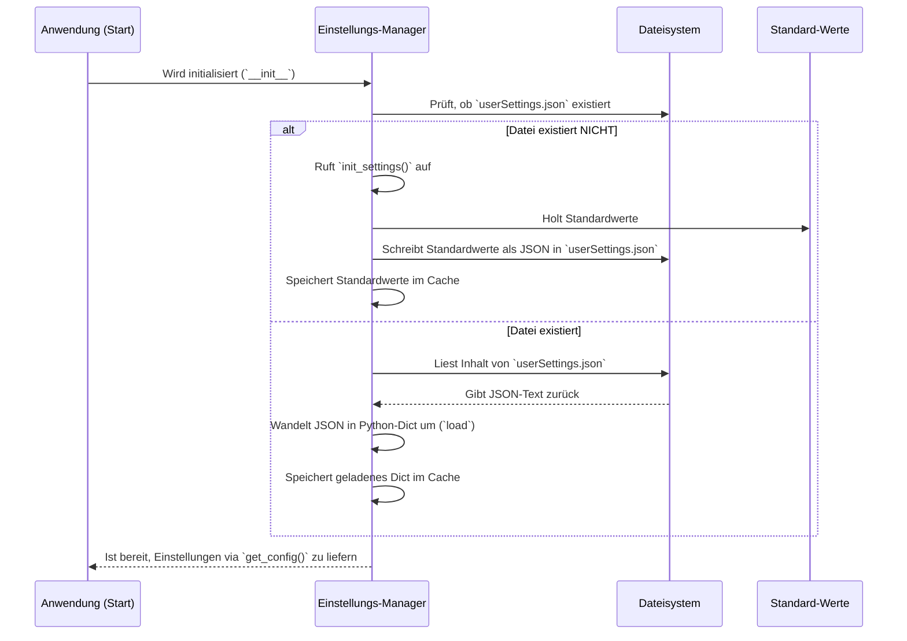

# Chapter 5: Benutzereinstellungen

Hallo und willkommen zurück! Im [letzten Kapitel](04_makro_dateiverwaltung.md) haben wir gelernt, wie du deine aufgezeichneten Makros als Dateien speichern und wieder laden kannst, damit deine Arbeit nicht verloren geht. Aber was ist mit den Einstellungen des Programms selbst? Vielleicht möchtest du, dass `MacroRecoder` deine Makros immer doppelt so schnell abspielt, oder du bevorzugst eine andere Tastenkombination ([Hotkey](03_hotkey_verwaltung.md)), um die Aufnahme zu starten. `MacroRecoder` muss sich diese Vorlieben irgendwie merken können, auch nachdem du das Programm geschlossen und neu gestartet hast. Genau dafür sind die **Benutzereinstellungen** zuständig!

Stell dir vor, du hast ein Makro aufgenommen, um eine langweilige Aufgabe zu automatisieren. Beim ersten Abspielen stellst du fest, dass es ein bisschen zu schnell läuft und du kaum mitkommst. Du möchtest die Wiedergabegeschwindigkeit auf 80% reduzieren. Ohne Benutzereinstellungen müsstest du das jedes Mal neu einstellen. Aber dank der Benutzereinstellungen kannst du die Geschwindigkeit einmal ändern, und `MacroRecoder` wird sich diese Einstellung für die Zukunft merken.

## Was sind Benutzereinstellungen?

Die Benutzereinstellungen sind wie das Gedächtnis von `MacroRecoder` für deine persönlichen Vorlieben. Es ist eine Sammlung von Optionen, die du anpassen kannst, um das Programm so zu konfigurieren, wie es für dich am besten passt. Denk an das Einstellungsmenü auf deinem Smartphone oder in deinem Lieblingsspiel – die Benutzereinstellungen in `MacroRecoder` erfüllen einen ähnlichen Zweck.

Hier sind einige Beispiele dafür, was du über die Benutzereinstellungen anpassen kannst:

*   **Wiedergabegeschwindigkeit:** Schneller oder langsamer als die Originalaufnahme.
*   **Wiederholungen:** Wie oft soll ein Makro wiederholt werden? Einmal, fünfmal oder sogar unendlich?
*   **Hotkeys:** Welche Tastenkombinationen sollen die [Aufnahme & Wiedergabe](02_makro_aufnahme___wiedergabe.md) starten oder stoppen? ([Hotkey-Verwaltung](03_hotkey_verwaltung.md))
*   **Aufnahme-Filter:** Sollen Mausbewegungen mit aufgezeichnet werden oder nur Klicks und Tastatureingaben?
*   **Sprache:** In welcher Sprache soll die Benutzeroberfläche von `MacroRecoder` angezeigt werden?
*   **Speicheroptionen:** Sollen Makro-Dateien platzsparend ("kompakt") gespeichert werden? ([Makro-Dateiverwaltung](04_makro_dateiverwaltung.md))

All diese Einstellungen werden an einem zentralen Ort gespeichert und verwaltet.

## Wie funktioniert das? (Die Idee dahinter)

Das Prinzip ist eigentlich ganz einfach:

1.  **Speicherort:** `MacroRecoder` legt auf deinem Computer an einer festen Stelle (abhängig vom Betriebssystem, z.B. in einem versteckten Konfigurationsordner) eine kleine Datei an, meistens `userSettings.json`.
2.  **Start:** Wenn du `MacroRecoder` startest, sucht es nach dieser Datei.
3.  **Lesen:** Findet es die Datei, liest es alle darin gespeicherten Einstellungen und konfiguriert sich entsprechend. Deine bevorzugte Geschwindigkeit, deine Hotkeys – alles wird geladen.
4.  **Erster Start:** Wenn die Datei nicht gefunden wird (weil du `MacroRecoder` zum ersten Mal benutzt oder die Datei gelöscht wurde), erstellt das Programm die Datei mit Standardwerten (z.B. normale Geschwindigkeit, keine Hotkeys).
5.  **Änderungen speichern:** Immer wenn du eine Einstellung änderst (typischerweise über ein Einstellungsfenster, das du über die [Menüleiste](06_menüleiste.md) erreichst), schreibt `MacroRecoder` den neuen Wert sofort zurück in die `userSettings.json`-Datei.
6.  **Ergebnis:** So "erinnert" sich das Programm an deine Vorlieben, auch wenn du es schließt und später neu öffnest.

## Die Einstellungsdatei: `userSettings.json`

Die Einstellungen werden in einer Datei im **JSON**-Format gespeichert. JSON steht für "JavaScript Object Notation" und ist ein einfaches Textformat, das sowohl für Menschen als auch für Maschinen gut lesbar ist. Es verwendet Schlüssel-Wert-Paare, ähnlich wie ein Wörterbuch.

Eine stark vereinfachte `userSettings.json` könnte so aussehen:

```json
{
    "Playback": {
        "Speed": 0.8,
        "Repeat": {
            "Times": 1
        }
    },
    "Hotkeys": {
        "Record_Start": ["Key.ctrl_l", "Key.f9"],
        "Playback_Start": []
    },
    "Recordings": {
        "Mouse_Move": false
    },
    "Language": "de"
}
```

Hier siehst du:
*   Die Wiedergabegeschwindigkeit (`Speed`) ist auf `0.8` (also 80%) gesetzt.
*   Der Hotkey zum Starten der Aufnahme (`Record_Start`) ist `Strg + F9`.
*   Mausbewegungen (`Mouse_Move`) sollen *nicht* aufgezeichnet werden (`false`).
*   Die Sprache ist auf Deutsch (`de`) eingestellt.

Diese strukturierte Form erlaubt es `MacroRecoder`, gezielt auf einzelne Werte zuzugreifen und sie zu ändern.

## Ein Blick unter die Haube: Die `UserSettings` Klasse

Im Code kümmert sich die Klasse `UserSettings` (in der Datei `src/utils/user_settings.py`) um alles, was mit den Benutzereinstellungen zu tun hat. Sie ist der zentrale Manager für das Lesen, Schreiben und Verwalten der `userSettings.json`-Datei.

### 1. Initialisierung und Pfadfindung (`__init__`)

Wenn `MacroRecoder` startet und eine `UserSettings`-Instanz erstellt wird, passiert als Erstes Folgendes:

```python
# Datei: src/utils/user_settings.py (stark vereinfacht)
from os import path, getenv, mkdir # Für Datei-/Ordneroperationen
from sys import platform # Um das Betriebssystem zu erkennen
from json import dumps, load # Für JSON-Verarbeitung

class UserSettings:
    def __init__(self, main_app):
        self.main_app = main_app # Referenz zur Hauptanwendung
        self.cached_settings = None # Cache für schnellen Zugriff

        # Finde den richtigen Ordner für Einstellungen
        if platform == "win32": # Wenn es Windows ist
            self.path_setting = path.join(getenv("LOCALAPPDATA"), "PyMacroRecord")
        elif "linux" in platform.lower(): # Wenn es Linux ist
            self.path_setting = path.join(path.expanduser("~"), ".config", "PyMacroRecord")
        # ... (ähnlich für macOS)

        # Der vollständige Pfad zur Einstellungsdatei
        self.user_setting = path.join(self.path_setting, "userSettings.json")

        # Prüfen, ob der Ordner und die Datei bereits existieren
        if not path.isdir(self.path_setting) or not path.isfile(self.user_setting):
            print("Einstellungsdatei nicht gefunden, erstelle Standardeinstellungen...")
            self.init_settings() # Ruft die Funktion zum Erstellen der Defaults auf
```

Dieser Code bestimmt zuerst den korrekten Speicherort für die `userSettings.json`, basierend auf deinem Betriebssystem (damit die Datei dort landet, wo Konfigurationsdateien üblicherweise gespeichert werden). Dann prüft er, ob die Datei existiert. Wenn nicht, ruft er `init_settings()` auf.

### 2. Standardeinstellungen erstellen (`init_settings`)

Diese Funktion wird aufgerufen, wenn keine `userSettings.json` gefunden wurde. Sie erstellt den notwendigen Ordner (falls dieser auch fehlt) und schreibt eine neue `userSettings.json` mit vordefinierten Standardwerten.

```python
# Datei: src/utils/user_settings.py (stark vereinfacht)

class UserSettings:
    # ... (__init__)

    def init_settings(self):
        """Erstellt die Einstellungsdatei mit Standardwerten."""
        # Erstelle den Ordner, falls er nicht existiert
        if not path.isdir(self.path_setting):
            mkdir(self.path_setting)

        # Definiere die Standard-Einstellungen als Python-Dictionary
        defaultSettings = {
            "Playback": {
                "Speed": 1, # Normale Geschwindigkeit
                "Repeat": {"Times": 1, "Infinite": False, ...}
            },
            "Recordings": {
                "Mouse_Move": True, # Mausbewegung standardmäßig aufzeichnen
                "Mouse_Click": True,
                "Keyboard": True,
            },
            "Hotkeys": { # Standardmäßig keine Hotkeys außer F3 zum Stoppen
                "Record_Start": [], "Record_Stop": [],
                "Playback_Start": [], "Playback_Stop": ["Key.f3"],
            },
            "Language": "en", # Standardsprache Englisch
            # ... (viele weitere Standardwerte)
        }

        # Wandle das Dictionary in einen formatierten JSON-Text um
        settings_json = dumps(defaultSettings, indent=4) # indent=4 für Lesbarkeit

        # Schreibe den JSON-Text in die Datei userSettings.json
        with open(self.user_setting, "w") as settingFile:
            settingFile.write(settings_json)
        
        self.cached_settings = defaultSettings # Setze Cache mit Defaults
```

Hier wird ein Python-Dictionary (`defaultSettings`) mit allen Optionen und ihren Standardwerten erstellt. Dieses Dictionary wird dann mithilfe von `dumps` in einen schönen, lesbaren JSON-String umgewandelt und in die `userSettings.json`-Datei geschrieben.

### 3. Einstellungen laden (`get_config`)

Diese Funktion ist dafür zuständig, die Einstellungen aus der `userSettings.json`-Datei zu lesen und für den Rest der Anwendung verfügbar zu machen. Um nicht bei jeder Abfrage die Datei neu lesen zu müssen (was langsam wäre), verwendet sie einen Cache (`self.cached_settings`).

```python
# Datei: src/utils/user_settings.py (stark vereinfacht)

class UserSettings:
    # ... (__init__, init_settings)

    def get_config(self):
        """Gibt die Benutzereinstellungen als Python-Dictionary zurück."""
        # Prüfe, ob die Einstellungen schon im Cache sind
        if self.cached_settings is None:
            print("Lade Einstellungen aus userSettings.json...")
            # Wenn nicht, öffne die Datei zum Lesen ('r' = read)
            with open(self.user_setting, "r") as settingFile:
                # Lese den JSON-Inhalt und wandle ihn in ein Python-Dictionary um
                self.cached_settings = load(settingFile)
        # Gib das Dictionary aus dem Cache zurück
        return self.cached_settings
```

Wenn `get_config()` zum ersten Mal aufgerufen wird (oder nachdem der Cache geleert wurde), liest es die `userSettings.json` mit `load()`, speichert das Ergebnis im Cache (`self.cached_settings`) und gibt es zurück. Bei allen weiteren Aufrufen wird direkt der schnelle Cache verwendet. Andere Teile des Programms, wie die [Makro-Aufnahme & Wiedergabe](02_makro_aufnahme___wiedergabe.md) (um die Geschwindigkeit zu prüfen) oder die [Hotkey-Verwaltung](03_hotkey_verwaltung.md) (um die definierten Hotkeys zu kennen), rufen diese Funktion auf, um an die aktuellen Einstellungen zu gelangen.

### 4. Änderungen speichern (`change_settings`, `update_settings`)

Wenn du in der Anwendung eine Einstellung änderst (z.B. die Wiedergabegeschwindigkeit in einem [GUI-Popup-Fenster](07_gui_popup_fenster.md)), wird typischerweise die `change_settings`-Methode aufgerufen. Sie aktualisiert den Wert im (gecachten) Einstellungs-Dictionary und sorgt dann dafür, dass die Änderung dauerhaft in die Datei geschrieben wird.

```python
# Datei: src/utils/user_settings.py (stark vereinfacht)

class UserSettings:
    # ... (andere Methoden)

    def change_settings(self, category, option, newValue):
        """Ändert eine spezifische Einstellung und speichert sie."""
        print(f"Ändere Einstellung: [{category}][{option}] = {newValue}")
        # 1. Hole die aktuellen Einstellungen (aus dem Cache)
        userSettings = self.get_config()

        # 2. Ändere den gewünschten Wert im Dictionary (hier sehr vereinfacht)
        # Im echten Code gibt es mehr Logik für verschachtelte Optionen
        if option:
             userSettings[category][option] = newValue
        else: # Änderung auf oberster Ebene
             userSettings[category] = newValue

        # 3. Aktualisiere den Cache
        self.cached_settings = userSettings

        # 4. Speichere das gesamte geänderte Dictionary zurück in die Datei
        # Wandle das Dictionary wieder in JSON-Text um
        updated_json = dumps(userSettings, indent=4)
        # Rufe die Hilfsfunktion zum Schreiben auf
        self.update_settings(updated_json)

    def update_settings(self, updatedValuesAsJson):
        """Schreibt den übergebenen JSON-Text in die Einstellungsdatei."""
        # Öffne die Datei zum Schreiben ('w' = write), überschreibt den alten Inhalt
        with open(self.user_setting, "w") as settingFile:
            settingFile.write(updatedValuesAsJson)
        print("Einstellungen erfolgreich in userSettings.json gespeichert.")
```

`change_settings` nimmt die Kategorie (z.B. `"Playback"`), die Option (z.B. `"Speed"`) und den neuen Wert (`newValue`, z.B. `0.8`) entgegen. Es aktualisiert das `userSettings`-Dictionary im Speicher (und Cache) und ruft dann `update_settings` auf. `update_settings` wandelt das gesamte, aktualisierte Dictionary zurück in JSON-Text (`dumps`) und schreibt diesen Text in die `userSettings.json`, wobei der alte Inhalt komplett überschrieben wird.

### Ablaufdiagramm: Einstellungen laden beim Start



Dieses Diagramm zeigt, wie `UserSettings` beim Start entweder die vorhandenen Einstellungen lädt oder neue Standardeinstellungen erstellt und diese dann im Cache bereithält.

## Fazit

Die **Benutzereinstellungen** sind das Herzstück der Personalisierung von `MacroRecoder`. Sie ermöglichen es der Anwendung, sich deine individuellen Vorlieben zu merken, von der Wiedergabegeschwindigkeit über deine bevorzugten [Hotkeys](03_hotkey_verwaltung.md) bis hin zur Sprache der Oberfläche.

Du hast gelernt:
*   Dass Einstellungen in einer **JSON-Datei** (`userSettings.json`) gespeichert werden.
*   Dass die Klasse `UserSettings` diese Datei beim Start liest und Änderungen wieder dorthin schreibt.
*   Dass Standardwerte verwendet werden, wenn du das Programm zum ersten Mal startest.
*   Dass ein **Cache** verwendet wird, um schnell auf die Einstellungen zugreifen zu können.

Diese gespeicherten Einstellungen machen `MacroRecoder` zu *deinem* Werkzeug, das sich an deine Arbeitsweise anpasst. Wie du auf die verschiedenen Optionen zugreifen und sie ändern kannst, geschieht meist über die [Menüleiste](06_menüleiste.md) oben im [Hauptanwendungsfenster](01_hauptanwendungsfenster.md). Genau diese Menüleiste schauen wir uns im nächsten Kapitel genauer an.

Weiter geht's mit: [Kapitel 6: Menüleiste](06_menüleiste.md)

---

Generated by [AI Codebase Knowledge Builder](https://github.com/The-Pocket/Tutorial-Codebase-Knowledge)