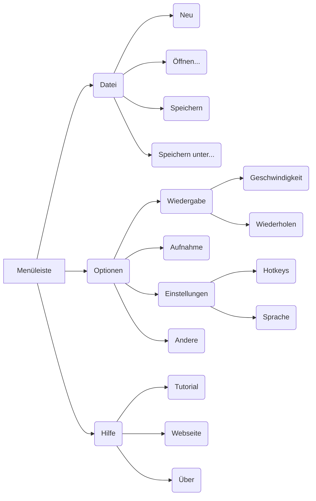
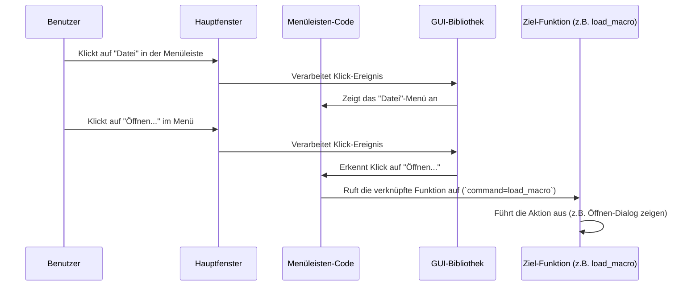

# Chapter 6: Menüleiste

Hallo und willkommen zu Kapitel 6! Im [vorigen Kapitel](05_benutzereinstellungen.md) haben wir uns angeschaut, wie `MacroRecoder` deine persönlichen [Benutzereinstellungen](05_benutzereinstellungen.md) speichert, damit sich das Programm an deine Arbeitsweise anpasst. Aber wie gelangst du eigentlich zu diesen Einstellungen oder zu anderen, weniger häufig genutzten Funktionen? Die Antwort findest du ganz oben im [Hauptanwendungsfenster](01_hauptanwendungsfenster.md): in der **Menüleiste**.

Stell dir vor, du möchtest wissen, wer dieses tolle `MacroRecoder`-Programm entwickelt hat, oder du suchst nach der Option, die [Wiedergabegeschwindigkeit](05_benutzereinstellungen.md) anzupassen. Du könntest jetzt alle Knöpfe durchprobieren, aber das wäre unübersichtlich. Viel einfacher ist es, wie in einem Restaurant in die Speisekarte zu schauen. Die Menüleiste von `MacroRecoder` ist genau das: eine übersichtliche "Karte" aller verfügbaren Funktionen und Optionen.

## Was ist die Menüleiste?

Die Menüleiste ist der schmale Balken ganz oben im [Hauptanwendungsfenster](01_hauptanwendungsfenster.md). Sie enthält eine Reihe von Wörtern wie "Datei", "Optionen", "Hilfe" – das sind die Hauptmenüs. Wenn du auf eines dieser Wörter klickst, klappt ein Menü mit weiteren Einträgen auf, ähnlich wie ein Inhaltsverzeichnis in einem Buch.

Ihre Hauptaufgabe ist es, einen **strukturierten Zugang** zu Funktionen zu bieten, die nicht ständig gebraucht werden und daher keinen eigenen Knopf im Hauptfenster haben. Dazu gehören:

*   **Dateiverwaltung:** Makros speichern, laden oder ein neues erstellen ([Makro-Dateiverwaltung](04_makro_dateiverwaltung.md)).
*   **Einstellungen:** Wiedergabeoptionen, Aufnahmeeinstellungen, Hotkeys anpassen ([Benutzereinstellungen](05_benutzereinstellungen.md)).
*   **Hilfe und Informationen:** Anleitungen, Versionsinformationen, Danksagungen finden.

Die Menüleiste hilft dir, dich in der Anwendung zurechtzufinden und gezielt die Funktion zu finden, die du gerade suchst.



*Diagramm: Vereinfachte Struktur der Menüleiste*

## Wie benutze ich die Menüleiste?

Die Bedienung ist denkbar einfach und funktioniert genau wie in den meisten anderen Programmen, die du kennst:

1.  **Klicke auf ein Hauptmenü:** Klicke mit der linken Maustaste auf eines der Wörter in der Leiste (z.B. "Datei").
2.  **Wähle einen Unterpunkt:** Ein Menü klappt nach unten auf. Bewege den Mauszeiger auf den gewünschten Eintrag (z.B. "Öffnen...") und klicke erneut darauf.
3.  **Aktion wird ausgeführt:** Die entsprechende Aktion wird ausgelöst. Bei "Öffnen..." erscheint zum Beispiel der Dialog zum Laden einer Makro-Datei ([Makro-Dateiverwaltung](04_makro_dateiverwaltung.md)). Bei anderen Einträgen öffnet sich vielleicht ein Einstellungsfenster ([GUI-Popup-Fenster](07_gui_popup_fenster.md)) oder eine Webseite im Browser.

Manche Menüpunkte haben ein kleines Dreieck ▶️ daneben. Das bedeutet, dass sich ein weiteres Untermenü öffnet, wenn du mit der Maus darüberfährst (z.B. bei "Optionen" -> "Wiedergabe").

## Ein Blick unter die Haube: Wie wird die Menüleiste erstellt?

Die Menüleiste ist ein Standardelement von grafischen Benutzeroberflächen (GUIs). In `MacroRecoder` wird sie mit der Python-Bibliothek `tkinter` erstellt. Die Hauptarbeit dafür leistet die Klasse `MenuBar`, die in der Datei `src/windows/main/menu_bar.py` definiert ist.

### Initialisierung im Hauptfenster

Im Code des [Hauptanwendungsfensters](01_hauptanwendungsfenster.md) (`src/windows/main/main_app.py`) wird die Menüleiste direkt am Anfang erstellt und dem Fenster hinzugefügt:

```python
# Datei: src/windows/main/main_app.py (Ausschnitt)
from tkinter import *
from windows.main.menu_bar import MenuBar # Importiert die Menüleisten-Klasse

class MainApp(Window):
    def __init__(self):
        super().__init__("PyMacroRecord", 350, 200) # Fenster erstellen
        # ... (andere Initialisierungen wie UserSettings)

        # Erstellt die Menüleiste und übergibt sich selbst (self) als Eltern-Fenster
        self.menu = MenuBar(self)

        # ... (Restlicher Code zum Erstellen der Knöpfe etc.)
```

Der entscheidende Teil ist `self.menu = MenuBar(self)`. Hier wird eine Instanz der `MenuBar`-Klasse erzeugt. Das `self` sorgt dafür, dass die `MenuBar` Zugriff auf das Hauptfenster und dessen Komponenten (wie z.B. die [Benutzereinstellungen](05_benutzereinstellungen.md) oder die [Makro-Logik](02_makro_aufnahme___wiedergabe.md)) hat.

### Aufbau der Menüleiste in `MenuBar`

Innerhalb der `MenuBar`-Klasse wird die eigentliche Struktur mit `tkinter`-Elementen aufgebaut. Schauen wir uns einen vereinfachten Ausschnitt für das "Datei"-Menü an:

```python
# Datei: src/windows/main/menu_bar.py (Stark vereinfacht)
from tkinter import Menu
# Import für die Dateiverwaltungsfunktionen
from utils.record_file_management import RecordFileManagement

class MenuBar(Menu): # Erbt von tkinter.Menu
    def __init__(self, parent): # parent ist das MainApp Fenster
        super().__init__(parent) # Initialisiert das Basis-Menü

        # Hole Text für Menüeinträge (abhängig von der Sprache)
        self.text_config = parent.text_content

        # Erstelle das Haupt-Menü-Objekt für die Leiste
        my_menu = Menu(parent)
        parent.config(menu=my_menu) # Weise es dem Hauptfenster zu

        # Erstelle das "Datei"-Menü (ein Untermenü)
        self.file_menu = Menu(my_menu, tearoff=0) # tearoff=0 verhindert "Abreißen"
        # Füge "Datei" zur Hauptleiste hinzu
        my_menu.add_cascade(label=self.text_config["file_menu"]["file_text"], menu=self.file_menu)

        # Hole Objekt für Datei-Funktionen (Speichern, Laden...)
        record_file_management = RecordFileManagement(parent, self)

        # Füge den Eintrag "Öffnen..." zum "Datei"-Menü hinzu
        self.file_menu.add_command(
            label=self.text_config["file_menu"]["load_text"], # Text des Eintrags
            accelerator="Ctrl+L", # Zeigt die Tastenkombination an
            command=record_file_management.load_macro # Funktion, die bei Klick ausgeführt wird
        )
        # ... (Weitere Einträge wie Speichern, Neu hinzufügen)
```

Was passiert hier Schritt für Schritt?
1.  `class MenuBar(Menu):`: Die Klasse `MenuBar` ist selbst ein `Menu`-Objekt von `tkinter`.
2.  `my_menu = Menu(parent)`: Ein leeres Menü-Objekt wird erstellt, das die eigentliche Menüleiste repräsentiert.
3.  `parent.config(menu=my_menu)`: Diese Leiste wird dem Hauptfenster (`parent`) zugewiesen.
4.  `self.file_menu = Menu(my_menu, tearoff=0)`: Ein weiteres `Menu`-Objekt wird erstellt, diesmal für das Untermenü "Datei".
5.  `my_menu.add_cascade(...)`: Fügt den Text "Datei" zur Hauptleiste hinzu. Wenn man darauf klickt, wird das `self.file_menu` angezeigt (`menu=self.file_menu`). `cascade` bedeutet, es ist ein Menü, das weitere Einträge enthält.
6.  `record_file_management = RecordFileManagement(...)`: Holt sich das Objekt, das die Funktionen zum Speichern und Laden bereitstellt ([Makro-Dateiverwaltung](04_makro_dateiverwaltung.md)).
7.  `self.file_menu.add_command(...)`: Fügt einen klickbaren Eintrag zum "Datei"-Menü hinzu.
    *   `label=...`: Der Text, der angezeigt wird (z.B. "Öffnen...").
    *   `accelerator=...`: Zeigt optional eine Tastenkombination ([Hotkey](03_hotkey_verwaltung.md)) neben dem Eintrag an.
    *   `command=...`: Das ist das Wichtigste! Es legt fest, welche Funktion aufgerufen werden soll, wenn der Benutzer auf diesen Menüpunkt klickt. Hier ist es die Funktion `load_macro` aus dem `record_file_management`-Objekt.

Auf ähnliche Weise werden alle anderen Menüs ("Optionen", "Hilfe") und deren Unterpunkte mit `add_cascade` (für weitere Untermenüs) und `add_command` (für auslösbare Aktionen) erstellt.

### Ablaufdiagramm: Menüpunkt auswählen

Wenn du auf einen Menüpunkt klickst, passiert Folgendes im Hintergrund:



Die Menüleiste dient also als Vermittler: Sie fängt deinen Klick ab und ruft die passende Funktion aus einem anderen Teil des Programms auf. Viele dieser Funktionen öffnen dann weitere Fenster, die sogenannten [GUI-Popup-Fenster](07_gui_popup_fenster.md).

## Fazit

Die **Menüleiste** ist dein Wegweiser durch die Funktionen von `MacroRecoder`. Sie bietet einen organisierten Zugriff auf alles, was nicht direkt über die Hauptknöpfe erreichbar ist. Du hast gelernt:

*   Was die Menüleiste ist und wozu sie dient (strukturierter Zugriff auf Funktionen).
*   Wie du sie benutzt (klicken, auswählen).
*   Dass sie im Code durch die `MenuBar`-Klasse (`src/windows/main/menu_bar.py`) erstellt wird.
*   Dass `tkinter`-Befehle wie `add_cascade` und `add_command` verwendet werden, um Menüs und klickbare Einträge zu definieren.
*   Dass jeder Menüeintrag mit einer Funktion (`command`) verbunden ist, die bei einem Klick ausgeführt wird.

Sie ist das zentrale Navigationsinstrument, das dich zu wichtigen Bereichen wie der [Makro-Dateiverwaltung](04_makro_dateiverwaltung.md) und den [Benutzereinstellungen](05_benutzereinstellungen.md) führt. Oftmals öffnen die Menüpunkte eigene kleine Fenster zur Interaktion. Genau diese Fenster schauen wir uns im nächsten Kapitel an.

Weiter geht's mit: [Kapitel 7: GUI-Popup-Fenster](07_gui_popup_fenster.md)

---

Generated by [AI Codebase Knowledge Builder](https://github.com/The-Pocket/Tutorial-Codebase-Knowledge)