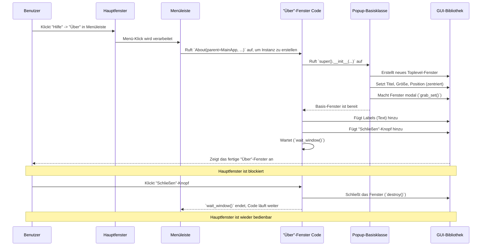

# Chapter 7: GUI-Popup-Fenster

Willkommen zum siebten und letzten Kapitel unseres Tutorials! Im [vorigen Kapitel](06_menüleiste.md) haben wir die [Menüleiste](06_menüleiste.md) kennengelernt, die uns als Wegweiser zu vielen Funktionen dient. Wenn du dort auf bestimmte Einträge klickst, wie zum Beispiel "Optionen" -> "Einstellungen" oder "Hilfe" -> "Über", öffnet sich oft ein neues, kleineres Fenster. Diese kleinen Helferlein nennen wir **GUI-Popup-Fenster**.

Stell dir vor, du möchtest die [Wiedergabegeschwindigkeit](05_benutzereinstellungen.md) deines Makros anpassen. Du klickst in der [Menüleiste](06_menüleiste.md) auf "Optionen" -> "Wiedergabe" -> "Geschwindigkeit". Daraufhin erscheint ein kleines, separates Fenster, das nur dazu dient, die Geschwindigkeit einzustellen. Du änderst den Wert, klickst auf "OK", und das Fenster verschwindet wieder. Dieses kleine, temporäre Fenster ist ein typisches Beispiel für ein GUI-Popup-Fenster.

## Was sind GUI-Popup-Fenster?

GUI-Popup-Fenster sind spezialisierte, oft kleinere Fenster, die **vorübergehend über dem [Hauptanwendungsfenster](01_hauptanwendungsfenster.md)** erscheinen. Sie dienen dazu, ganz bestimmte Aufgaben zu erledigen oder Informationen anzuzeigen, ohne das Hauptfenster zu überladen.

Denk an sie wie kleine **Notizzettel**, die kurz auf deinem Hauptdokument erscheinen:
*   Sie fragen nach einer bestimmten Information (z.B. "Wie schnell soll abgespielt werden?").
*   Sie zeigen eine kurze Nachricht an (z.B. "Makro gespeichert!").
*   Sie präsentieren Detailinformationen (z.B. die Versionsnummer im "Über"-Fenster).
*   Sie fordern eine Bestätigung (z.B. "Möchtest du wirklich beenden?").

Ein wichtiges Merkmal dieser Popup-Fenster ist, dass sie oft **modal** sind. Das bedeutet, sie "schnappen" sich den Fokus der Anwendung. Du musst zuerst mit dem Popup-Fenster interagieren (z.B. es schließen oder auf "OK" klicken), bevor du wieder das Hauptfenster bedienen kannst. Das stellt sicher, dass du die im Popup angeforderte Aufgabe erledigst, bevor du weitermachst.

## Wie funktionieren sie? (Die Idee)

In `MacroRecoder` gibt es eine Vielzahl solcher Popup-Fenster für unterschiedliche Zwecke: Einstellungsdialoge, Informationsfenster, Warnmeldungen usw. Um sicherzustellen, dass all diese kleinen Fenster ein **konsistentes Aussehen und Verhalten** haben (z.B. immer in der Mitte des Bildschirms erscheinen und den Fokus korrekt handhaben), gibt es eine gemeinsame Basis: die `Popup`-Klasse.

Fast jedes kleine Fenster, das in `MacroRecoder` aufspringt, ist eine spezialisierte Version dieser `Popup`-Basisklasse. Es erbt die grundlegenden Eigenschaften und fügt dann seine eigenen spezifischen Bedienelemente (Knöpfe, Eingabefelder, Texte) hinzu.

## Die Basisklasse: `Popup`

Die Datei `src/windows/popup.py` enthält die Definition der `Popup`-Klasse. Sie ist der "Bauplan" für alle unsere kleinen Zusatzfenster. Schauen wir uns eine vereinfachte Version an:

```python
# Datei: src/windows/popup.py (Vereinfacht)
from tkinter import * # GUI-Bibliothek
from sys import platform # Für Betriebssystem-Infos

class Popup(Toplevel): # Erbt von Toplevel (einem neuen Fenster)
    def __init__(self, name, w, h, parent):
        # Initialisiert das neue Fenster (Toplevel) als Kind des Hauptfensters (parent)
        super().__init__(parent)
        self.title(name) # Setzt den Titel des Popup-Fensters

        # Bildschirmbreite und -höhe ermitteln
        ws = self.winfo_screenwidth()
        hs = self.winfo_screenheight()

        # Position für die Mitte berechnen
        x = (ws / 2) - (w / 2)
        y = (hs / 2) - (h / 2)

        # Fenstergröße (w, h) und Position (x, y) setzen
        self.geometry('%dx%d+%d+%d' % (w, h, x, y))
        self.resizable(False, False) # Größe nicht änderbar machen

        # Fokus auf dieses Fenster legen (modal machen)
        self.grab_set()

        # (Optional: Anpassungen für Windows/Mac, um sicherzustellen,
        #  dass das Fenster immer oben ist)
        # if platform == "win32": self.attributes("-toolwindow", 1)
        # else: self.attributes("-topmost", 1)
```

Was macht dieser Code?
1.  `class Popup(Toplevel):`: Definiert eine neue Klasse `Popup`, die von `Toplevel` erbt. `Toplevel` ist der `tkinter`-Befehl zum Erstellen eines neuen, unabhängigen Fensters.
2.  `super().__init__(parent)`: Initialisiert das `Toplevel`-Fenster und macht es zu einem "Kind" des Fensters, von dem aus es geöffnet wurde (`parent`, normalerweise das [Hauptanwendungsfenster](01_hauptanwendungsfenster.md)).
3.  `self.title(name)`: Setzt den Text in der Titelleiste des Popups.
4.  `ws = self.winfo_screenwidth()...`: Holt die Bildschirmgröße.
5.  `x = ...`, `y = ...`: Berechnet die Koordinaten (x, y), damit das Fenster genau in der Mitte des Bildschirms platziert wird.
6.  `self.geometry(...)`: Setzt die gewünschte Breite (`w`), Höhe (`h`) und die berechnete Position (`x`, `y`) des Fensters.
7.  `self.resizable(False, False)`: Verhindert, dass der Benutzer die Größe des Popups ändern kann.
8.  `self.grab_set()`: Das ist entscheidend für das modale Verhalten! Dieser Befehl sorgt dafür, dass alle Eingaben (Mausklicks, Tastatur) nur noch an dieses Popup-Fenster gehen, bis es geschlossen wird. Das Hauptfenster ist solange blockiert.

Diese `Popup`-Klasse stellt also sicher, dass jedes davon abgeleitete Fenster automatisch zentriert wird, eine feste Größe hat und den Fokus an sich reißt.

## Ein Beispiel: Das "Über"-Fenster (`About`)

Sehen wir uns an, wie ein konkretes Popup-Fenster, das "Über"-Fenster (aus `src/windows/help/about.py`), diese Basisklasse nutzt.

```python
# Datei: src/windows/help/about.py (Vereinfacht)
from tkinter import *
from tkinter.ttk import *
from windows.popup import Popup # Importiert unsere Basisklasse

class About(Popup): # Erbt von Popup!
    def __init__(self, parent, main_app, version, updated):
        # 1. Ruft den Konstruktor der Popup-Basisklasse auf:
        #    Setzt Titel, Breite (300), Höhe (150), und Elternfenster (parent)
        super().__init__("Über PyMacroRecord", 300, 150, parent)

        # 2. Fügt eigene Inhalte hinzu (Labels für Infos, Knopf zum Schließen)
        Label(self, text=f"Herausgeber: LOUDO").pack(pady=3)
        Label(self, text=f"Version: {version} ({updated})").pack(pady=3)
        Label(self, text=f"Lizenz: GPL v3.0").pack(pady=3)

        # Bereich für Knöpfe
        buttonArea = Frame(self)
        Button(buttonArea, text="Schließen", command=self.destroy).pack(padx=10)
        buttonArea.pack(side=BOTTOM, pady=10)

        # 3. Warten, bis das Fenster geschlossen wird
        #    (verhindert währenddessen Aufnahme)
        main_app.prevent_record = True # Aufnahme pausieren
        self.wait_window()             # Warten, bis Fenster geschlossen
        main_app.prevent_record = False # Aufnahme wieder erlauben
```

Was passiert hier?
1.  `class About(Popup):`: Die `About`-Klasse erbt alle Eigenschaften und Methoden der `Popup`-Klasse.
2.  `super().__init__(...)`: Ruft den `__init__`-Code der `Popup`-Klasse auf. Damit wird das Fenster erstellt, zentriert und modal gemacht. Wir übergeben hier den Titel "Über PyMacroRecord", die gewünschte Größe (300x150 Pixel) und das `parent`-Fenster (das [Hauptanwendungsfenster](01_hauptanwendungsfenster.md)).
3.  `Label(...)`, `Button(...)`, `pack(...)`: Nachdem das Basis-Popup erstellt ist, werden hier die spezifischen Inhalte für das "Über"-Fenster hinzugefügt – Textfelder (`Label`) mit den Informationen und ein Knopf (`Button`) zum Schließen des Fensters (`command=self.destroy`).
4.  `self.wait_window()`: Dieser Befehl hält die Ausführung an dieser Stelle an, bis das `About`-Fenster geschlossen wird (z.B. durch Klick auf den "Schließen"-Knopf). Währenddessen wird auch die Makro-Aufnahme über `main_app.prevent_record` verhindert.

Indem `About` von `Popup` erbt, muss es sich nicht selbst um die Positionierung oder das modale Verhalten kümmern – das erledigt die Basisklasse. Es konzentriert sich nur darauf, *was* im Fenster angezeigt werden soll.

## Ablauf: Öffnen eines Popup-Fensters

Stellen wir uns vor, du klickst im [Hauptanwendungsfenster](01_hauptanwendungsfenster.md) auf "Hilfe" -> "Über". Das löst folgenden Ablauf aus:



Dieser Ablauf zeigt, wie die `About`-Klasse die `Popup`-Basisklasse nutzt, um mit Hilfe von `tkinter` ein standardisiertes, zentriertes und modales Fenster zu erzeugen, bevor sie ihre eigenen Inhalte hinzufügt.

## Viele kleine Helfer

Fast alle Einstellungsdialoge und Informationsfenster in `MacroRecoder`, die du über die [Menüleiste](06_menüleiste.md) erreichst, folgen diesem Muster und erben von der `Popup`-Klasse. Beispiele aus dem Code sind:

*   `Delay.py`: Zum Einstellen der Verzögerung bei Wiederholungen.
*   `Hotkeys.py`: Zum Konfigurieren der [Hotkeys](03_hotkey_verwaltung.md).
*   `SelectLanguage.py`: Zum Auswählen der Sprache.
*   `AfterPlayBack.py`: Zum Festlegen, was nach der Wiedergabe passieren soll.
*   `Donors.py`: Zeigt eine Liste von Unterstützern an.
*   `NewVerAvailable.py`: Informiert über eine neue Programmversion.

Sie alle nutzen die `Popup`-Basis, um ein konsistentes Benutzererlebnis zu gewährleisten. Sie erhalten oft auch eine Referenz auf das `main_app`-Objekt, um auf [Benutzereinstellungen](05_benutzereinstellungen.md) zugreifen oder diese ändern zu können.

## Fazit

GUI-Popup-Fenster sind unverzichtbare kleine Helfer in `MacroRecoder`. Sie ermöglichen es, spezifische Aufgaben oder Einstellungen zu bearbeiten, ohne das Hauptfenster zu überladen. Du hast gelernt:

*   Was Popup-Fenster sind und wozu sie dienen (temporär, spezifische Aufgaben, oft modal).
*   Dass die Klasse `Popup` (`src/windows/popup.py`) als **Basisklasse** dient, um sicherzustellen, dass alle Popups **zentriert** erscheinen und sich **modal** verhalten (`grab_set()`).
*   Wie ein konkretes Popup (z.B. das "Über"-Fenster `About`) von `Popup` **erbt** und dann seine eigenen Inhalte hinzufügt (`Label`, `Button`).
*   Wie der Ablauf vom Klick auf einen Menüpunkt bis zur Anzeige des Popups aussieht.

Diese konsistente Handhabung von Popup-Fenstern trägt maßgeblich zur Benutzerfreundlichkeit von `MacroRecoder` bei.

Damit sind wir am Ende unseres Tutorials angelangt! Wir hoffen, diese Reise durch die verschiedenen Komponenten von `MacroRecoder` – vom [Hauptanwendungsfenster](01_hauptanwendungsfenster.md) über die [Aufnahme & Wiedergabe](02_makro_aufnahme___wiedergabe.md), [Hotkeys](03_hotkey_verwaltung.md), [Dateiverwaltung](04_makro_dateiverwaltung.md), [Einstellungen](05_benutzereinstellungen.md) und die [Menüleiste](06_menüleiste.md) bis hin zu diesen kleinen Popups – hat dir geholfen, die Funktionsweise des Programms besser zu verstehen. Viel Spaß beim Automatisieren deiner Aufgaben!

---

Generated by [AI Codebase Knowledge Builder](https://github.com/The-Pocket/Tutorial-Codebase-Knowledge)