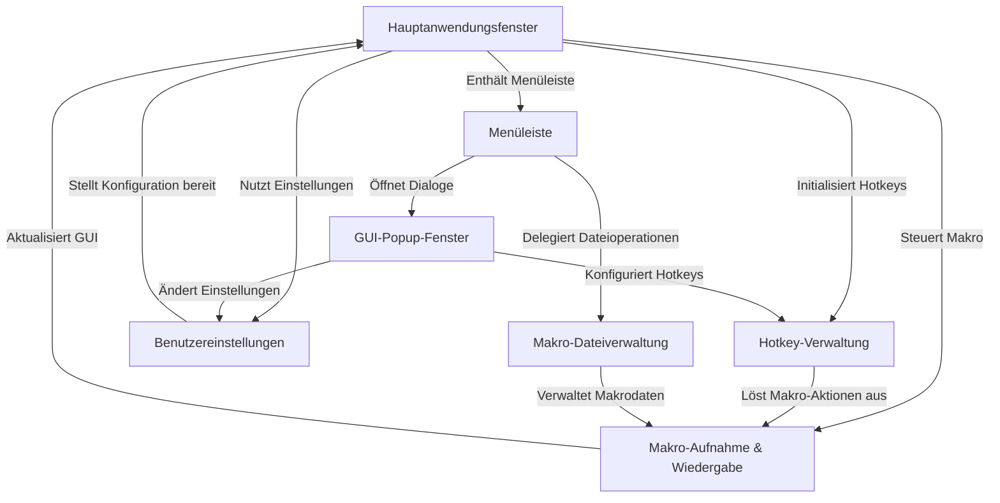

# Tutorial: MacroRecoder

Das Projekt `MacroRecoder` ermöglicht es Benutzern, **Maus- und Tastaturaktionen aufzuzeichnen** und wiederzugeben.
Es verfügt über ein *Hauptfenster* mit Aufnahme- und Wiedergabeschaltflächen sowie einer Menüleiste. Die Kernfunktionalität (Aufnahme & Wiedergabe) wird von der *Makro-Engine* übernommen. Benutzer können **globale Hotkeys** definieren, um die Aufnahme und Wiedergabe auch im Hintergrund zu steuern. Diverse *Einstellungen* (z.B. Geschwindigkeit, Wiederholungen, Sprache) können angepasst und gespeichert werden. Aufgezeichnete Makros können zudem **in Dateien gesichert** und wieder geladen werden, wobei *Popup-Fenster* für spezifische Einstellungen oder Informationen verwendet werden.

**Source Repository:** [https://github.com/LOUDO56/PyMacroRecord](https://github.com/LOUDO56/PyMacroRecord)

## Chapters

1. [Hauptanwendungsfenster](01_hauptanwendungsfenster.md)
2. [Makro-Aufnahme & Wiedergabe](02_makro_aufnahme___wiedergabe.md)
3. [Hotkey-Verwaltung](03_hotkey_verwaltung.md)
4. [Makro-Dateiverwaltung](04_makro_dateiverwaltung.md)
5. [Benutzereinstellungen](05_benutzereinstellungen.md)
6. [Menüleiste](06_menüleiste.md)
7. [GUI-Popup-Fenster](07_gui_popup_fenster.md)

---

Generated by [AI Codebase Knowledge Builder](https://github.com/The-Pocket/Tutorial-Codebase-Knowledge)